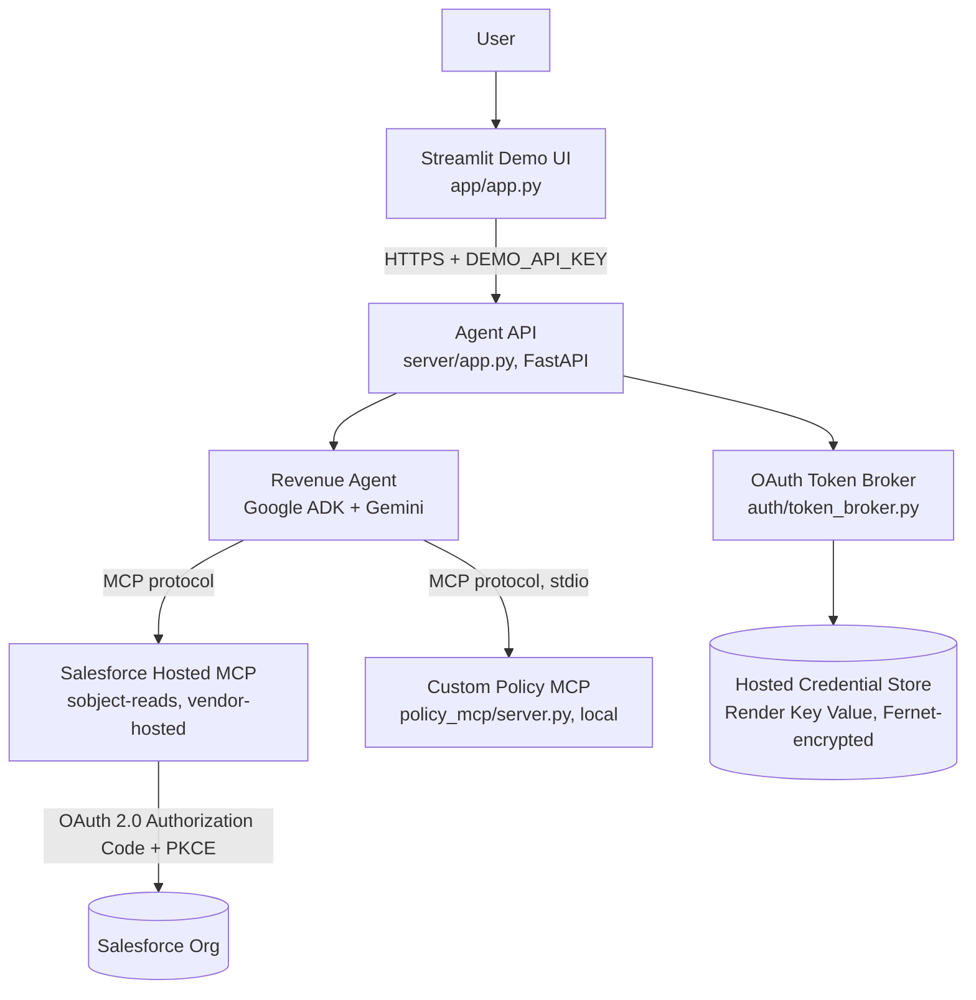

# Salesforce MCP Revenue Agent — Reference Architecture Proof of Concept

A working proof of concept for a **governed AI agent** that reasons over a real Salesforce org and a
custom business-policy service through the **Model Context Protocol (MCP)**, rather than through
integration code embedded in the reasoning layer.

## The problem

Enterprise AI agents need access to real business systems — CRM records, policy rules, other internal
services — to be useful. The common shortcut is to give the agent direct API credentials and let it call
those systems itself, which quietly couples the reasoning layer to every system it touches and makes the
resulting access boundary hard to reason about, audit, or govern.

This project explores an alternative: **MCP as a capability boundary**. The model does not receive
Salesforce credentials and does not call Salesforce APIs directly; the integration layer owns OAuth/token
handling and invokes Salesforce through Hosted MCP, which exposes a fixed, inspectable set of tools and
enforces its own access rules independently of the model. What the agent can do is defined by what the
MCP server's catalogue exposes, not by what the model decides to attempt.

## What this project proves

```
User
  |
  v
Revenue Agent
Google ADK + Gemini
  |
  +-------------------------+
  |                         |
  v                         v
Salesforce Hosted MCP     Custom Policy MCP
vendor capability         application capability
  |                         |
  v                         v
CRM evidence              deterministic scoring
```

Two independent MCP servers — one vendor-hosted (Salesforce), one built for this project (Policy MCP) —
are both exposed to the same agent, and the agent itself decides which to call and how to combine their
output, using the same protocol for both. Nothing in the application code special-cases either server.

This demonstrates **agent-driven orchestration across two independent MCP servers using a common
protocol.** It does **not** demonstrate that MCP servers are interchangeably portable in general, that
this specific agent works unmodified against arbitrary third-party MCP servers, or that the underlying
LLM provider is swappable (see "Known limitations" below — this is Gemini-only today, by design, not yet
tested otherwise).

## Business use case: revenue opportunity prioritisation

Salesforce holds the actual facts — which opportunities exist, their amount, stage, close date, and
recent activity. Policy MCP holds a separate, deterministic prioritisation policy — a fixed set of
business rules for what makes an opportunity worth attention (large deal size, closing soon, a strategic
account, gone quiet, in a late sales stage). Neither system does the other's job: Salesforce doesn't know
the policy, and Policy MCP doesn't know any CRM data. The agent retrieves both and explains, in plain
language, which opportunities to prioritise and why — citing the real CRM facts and the real policy
factors behind each recommendation.

## Architecture



Kept intentionally at the level a technical audience can absorb in one look — the full component and
deployment diagrams (Render services, credential flow, sequence diagrams) are in
[`docs/technical-solution-design.md`](docs/technical-solution-design.md), not duplicated here.

## Key architectural principles

- **MCP as capability boundary** — what the agent can do is defined by an MCP server's tool catalogue,
  not by application code or prompt wording.
- **Vendor MCP + custom MCP, same protocol** — Salesforce's server and this project's own Policy MCP are
  both ordinary `McpToolset` instances to the agent; neither is special-cased.
- **Separation of reasoning from systems of record** — the LLM never talks to Salesforce's API directly.
- **Deterministic policy outside the LLM** — prioritisation scoring (`policy_mcp/policy.py`) is plain,
  tested Python logic, not something the model infers or approximates.
- **Least privilege** — the Salesforce Permission Set grants read-only Account/Opportunity/Task access;
  the only active MCP server (`sobject-reads`) has no create/update/delete tool in its catalogue at all.
- **OAuth 2.0 Authorization Code + PKCE** — no client secret exists for this app; Salesforce's own
  `isConsumerSecretOptional` public-client mode is used deliberately.
- **Credentials outside the model** — the agent never sees a token; a header-provider function injects a
  Bearer token per MCP call, sourced from a token broker the model has no access to.
- **Configuration over unnecessary customisation** — Policy MCP's rules are plain committed Python, not a
  rules-engine product; hosted credential persistence is a managed Render Key Value instance, not a
  custom database.
- **Observable/testable agent behaviour** — every acceptance claim in this repo is backed by an automated
  test, a live run, or both (see [`docs/evidence-matrix.md`](docs/evidence-matrix.md)).
- **Explicit trust boundaries** — each MCP server is documented as its own independent trust domain;
  approving one never implicitly approves another (see "Security model" below).

## Security model

Three layers, and they are **not equivalent guarantees**:

| Layer | What it is | What it actually stops |
|---|---|---|
| **1 — Agent behavioural instructions** | The system prompt tells the model not to modify Salesforce data and how to use each MCP server (`agent/prompts.py`) | Ordinary model behaviour under ordinary conditions. **Not** an enforced boundary — a sufficiently adversarial input could in principle cause a model to disregard it. |
| **2 — MCP capability/tool catalogue** | The Salesforce MCP server (`sobject-reads`) has **no create/update/delete tool in its catalogue at all** — confirmed independently via Postman/MCP Inspector before any agent code existed, and re-confirmed live through the agent itself | The actual enforced guarantee: even a fully successful prompt-injection attack has no mutation-shaped tool to invoke, because none exists. |
| **3 — Salesforce identity/platform permissions** | The org user's Permission Set (`Revenue_Agent_Read_Access`) | **Partially validated.** The Permission Set is additive, not restrictive — Salesforce Profiles can still grant broader access underneath it. A genuinely restricted second test identity, to prove *effective* access is read-only independent of the MCP catalogue, is a deliberately deferred open item (see "Known limitations"). |

Layer 1 is never treated as sufficient on its own. Full detail, including the evidence that Layers 1 and
2 both hold through the agent, is in [`docs/security-model.md`](docs/security-model.md).

## Multi-MCP orchestration

```
Question: "Using our revenue prioritisation policy, which of my high-value
open opportunities should I prioritise and why?"
  |
  v
Agent (Gemini decides every tool call — nothing here is scripted)
  |
  +--> Salesforce MCP: soqlQuery -- retrieve real open opportunities + facts
  |
  +--> Policy MCP: get_scoring_policy -- retrieve the actual rules
  |
  +--> Policy MCP: score_opportunity (once per candidate opportunity)
  |
  v
Agent's answer: CRM evidence (Salesforce) + policy reasoning (Policy MCP),
explicitly distinguishing which is which
```

Live-verified: asked this exact question against the real deployed agent, the model called
`getUserInfo → get_scoring_policy → getObjectSchema → soqlQuery (×3) → score_opportunity (×12)` entirely
on its own, then produced an answer separating "Salesforce Evidence" from policy scoring per opportunity.
Application code never scripts this sequence — see
[`docs/developer-guide.md`](docs/developer-guide.md)'s Gate 7 section for the full trace.

## Demo

Three questions exercise the whole architecture:

| Question | What to observe |
|---|---|
| *"Show me Closed Won opportunities worth more than $250K."* | A real table of Salesforce records with real Opportunity IDs; the evidence panel shows `soqlQuery` (Layer 2's read-only boundary in action, not a mocked answer) |
| *"Update opportunity United Oil Refinery Generators to Closed Lost."* | A clean refusal, citing the real current record for context; the evidence panel shows **no mutation-shaped tool call**, because none exists in the catalogue — not "a write was attempted and blocked" |
| *"Using our revenue prioritisation policy, which of my high-value open opportunities should I prioritise and why?"* | Both MCP servers used in one answer, with CRM evidence and policy scoring explicitly distinguished |

Presenter-facing runbook (pre-demo checklist, talk track, failure recovery) is in
[`docs/demo-runbook.md`](docs/demo-runbook.md).

## Evidence / testing

- **106 automated tests** (`pytest --collect-only`), **101 passed + 5 skipped offline** (`pytest -q`) —
  the 5 skipped are the opt-in live suites (see below), not failures.
- **Offline unit/integration tests** cover config validation, the OAuth/PKCE token broker, both credential
  store backends, the hosted FastAPI entry point, log redaction, the Streamlit UI, and Policy MCP's
  scoring logic — all fully mocked, no live dependency.
- **Live integration tests** (`pytest --run-integration ...`, opt-in — hit the real Salesforce org and
  real Gemini) prove: a positive question returns real cited data; a mutation request never calls
  anything outside the approved read-only allowlist; a nonexistent-opportunity question doesn't get
  invented detail; a bulk mutation phrasing is refused the same way as a single-record one; and the
  multi-MCP question demonstrably combines real values from both servers.
- **MCP catalogue verification**: Salesforce's six-tool `sobject-reads` catalogue and Policy MCP's
  two-tool catalogue are each pinned as fixtures and re-verified live, not assumed static.
- **Restart/token persistence**: the hosted deployment was verified to survive a real Render restart
  without needing to re-authorize (Gate 4 evidence).
- **Secret/log protection**: a dedicated redaction module and test suite prevent unanticipated exceptions
  from leaking secret values into logs; a full-history secret scan is documented in
  [`docs/public-release-readiness.md`](docs/public-release-readiness.md).

Full mapping of every claim to its actual test/evidence is in
[`docs/evidence-matrix.md`](docs/evidence-matrix.md) — treat that file, not this README, as the source of
truth if the two ever seem to disagree.

## Gate history

| Gate | Capability proven | Result |
|---|---|---|
| 0 | Feasibility research and implementation plan | ✅ Complete |
| 1 | Salesforce foundation — least-privilege Permission Set, ECA, sample data | ✅ Complete |
| 2 | Salesforce Hosted MCP proven independently of any LLM (Postman/MCP Inspector) | ✅ Complete |
| 3 | Google ADK + Gemini agent, OAuth/PKCE token broker, live Salesforce reads | ✅ Complete |
| 4 | Secure hosted runtime on Render — hosted credential persistence, production entry point | ✅ Complete |
| 5 | Streamlit thin UI, deployed for a client-site demo without a laptop | ✅ Complete |
| 6 | Security unhappy-path tests (AT-01/02/03/04/06) | ⚠️ Deliberately partial — two live-org tests deferred, see below |
| 7 | Custom Policy MCP + multi-MCP orchestration | ✅ Complete |
| 8 | Documentation, demo, and public-release readiness (this pass) | ✅ Complete |

## Running locally

Prerequisites: Python 3.11+, a Salesforce org with Hosted MCP enabled (Developer Edition works — see
[`docs/gate-0-plan.md`](docs/gate-0-plan.md)), a Google AI Studio API key.

```bash
git clone https://github.com/vikaspandey1007/sfdc-mcp-poc.git
cd sfdc-mcp-poc
python -m venv .venv && .venv/Scripts/activate   # or source .venv/bin/activate on Linux/macOS
pip install -e ".[dev]"
cp .env.example .env   # fill in your own values -- never commit this file
python -m auth.token_broker   # one-time interactive OAuth authorization
adk web   # or: streamlit run app/app.py, against a locally-run server/app.py
```

Never put real credentials anywhere but `.env` (gitignored) or your OS keyring. `.env.example` documents
every variable's *shape*, never a real value.

## Hosted demo / deployment

Three Render services, declared as one Blueprint (`render.yaml`): a FastAPI agent API
(`sfdc-mcp-poc-agent`), a Streamlit demo UI (`sfdc-mcp-poc-ui`), and a managed Key Value instance
(`sfdc-mcp-poc-tokens`) holding the Fernet-encrypted OAuth token pair. No database, no custom
infrastructure beyond that. Full provisioning steps and the complete environment-variable reference (with
every secret's *name*, never its value) are in [`docs/deployment-guide.md`](docs/deployment-guide.md).

## Known limitations

- Salesforce capability is **intentionally read-only** — this is the security model, not an oversight.
- A genuinely restricted second Salesforce test identity, to prove effective access (not just the MCP
  catalogue) is restrictive end-to-end, remains **deferred** (Gate 6).
- A live test of Salesforce credential revocation/denial handling remains **deferred** — it would require
  breaking the working demo's real credentials (Gate 6); the offline-mocked equivalent is tested.
- Policy MCP currently uses a **local stdio transport** — a deliberate POC-scoped deployment choice, not
  the architectural pattern itself (see [`docs/decisions/ADR-004-policy-mcp-design.md`](docs/decisions/ADR-004-policy-mcp-design.md)).
- Policy rules are **deployment-time configuration** (committed Python) — there is no runtime API to edit
  scoring weights without a code change.
- **Gemini is currently the only implemented LLM provider.** Provider portability has **not** been
  demonstrated — this is a stated future direction, not a proven capability.
- **Demandbase and Gong are future architecture, not implemented** — mentioned only as the shape this
  pattern is designed to extend to, per the original build brief's own future-state section.
- Demo authentication (`DEMO_API_KEY`, `UI_ACCESS_CODE`) is a **shared-secret scheme for a POC demo**, not
  enterprise SSO/identity federation.

## Future evolution

**Clearly future, not built:**

```
Revenue Intelligence Agent
   |
   +-- Salesforce MCP
   +-- Demandbase MCP    (future — intent/account intelligence)
   +-- Gong MCP           (future — conversation intelligence)
   +-- Policy/Enterprise MCPs (future — additional business capabilities)
```

Each additional MCP server would be its own independent trust domain, requiring its own delta security
assessment — approving this project's two servers does not pre-approve any future one.

**Also future — model-provider portability:**

```
Revenue Agent
   |
   +-- Gemini   (implemented, proven)
   +-- Claude   (architectural direction only)
   +-- OpenAI   (architectural direction only)
   +-- other models
```

Nothing in this repository has tested the agent against a non-Gemini model. This is a stated direction
the MCP-based architecture is designed to make *feasible*, not a capability this POC has demonstrated.

## Disclaimer

This is a **reference/proof-of-concept implementation**. It demonstrates an architecture pattern with real
evidence, not a production-ready system. Before any production deployment, it requires additional
security review, enterprise identity/SSO integration, a genuinely restricted Salesforce test identity,
operational hardening (monitoring, alerting, on-call), scaling/availability design, and governance controls
beyond what a single-demo POC needs. See [`docs/technical-solution-design.md`](docs/technical-solution-design.md)'s
"Productionisation considerations" section for the fuller list.
