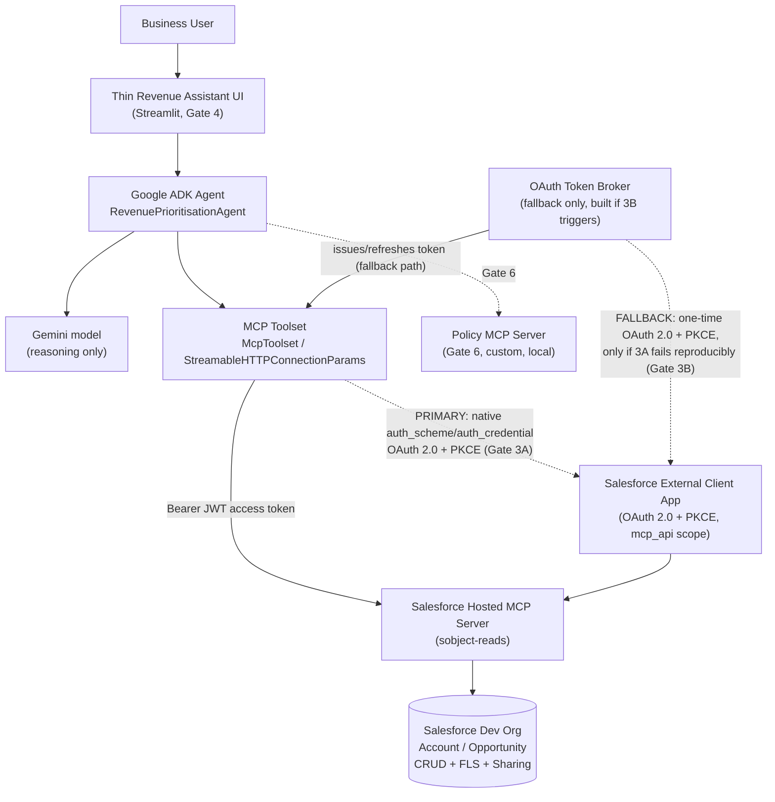
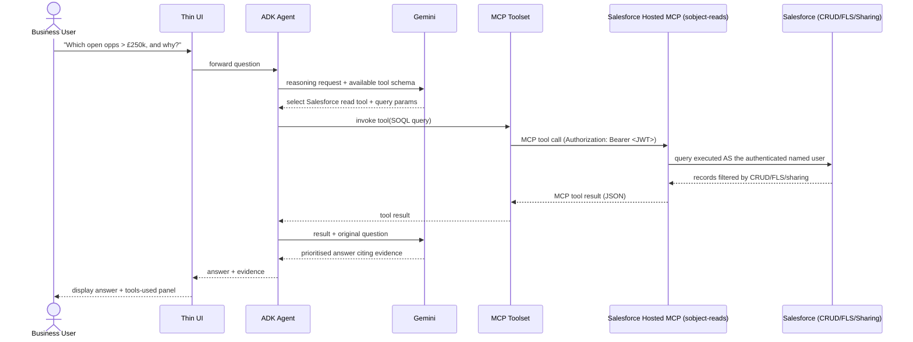
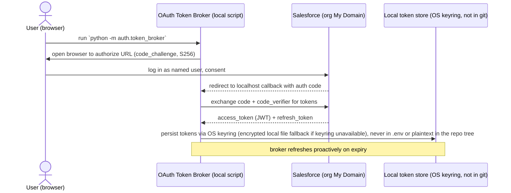
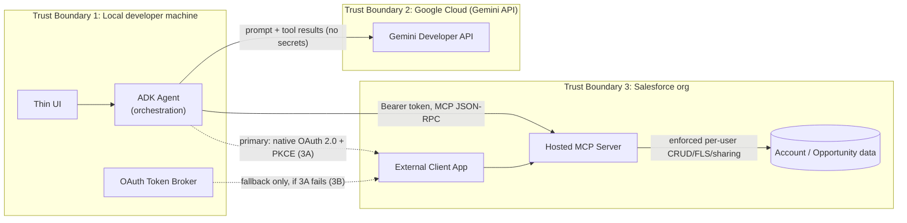

# Gate 0 Feasibility Report & Implementation Plan
### Revenue Prioritisation Agent — Salesforce Hosted MCP + Google ADK/Gemini

Status: **DRAFT — awaiting review/approval**
Author: Claude (Sonnet 5), synthesizing two primary-source research passes
Date: 2026-09-15 (revised same day: D2 authentication strategy flipped to
native-first per reviewer feedback — see D2 rationale for why this is an
improvement, not just a preference swap)

This document is the Gate 0 deliverable required by the build brief: a feasibility
verdict, validated architecture, Salesforce/Google setup plans, repository plan,
gate-by-gate backlog, security assessment, decision log, open questions, and
implementation order. **No agent/app code has been written yet.** Only this plan
and repository scaffolding (`.gitignore`, this doc) exist so far.

All claims below are sourced from live WebFetch/WebSearch against
developer.salesforce.com, help.salesforce.com, the `google/adk-python` GitHub repo
(including issue/PR history via `gh`), `ai.google.dev`, `cloud.google.com`, and
`modelcontextprotocol.io`, performed 2026-09-15. Confidence and source URLs are
given per claim. Anything not independently verified is explicitly flagged —
per the brief, this document does not silently paper over discrepancies.

---

## A. Feasibility verdict

**Yes, this architecture can be implemented today — with two caveats that must be
actively managed, not assumed away.**

- Salesforce Hosted MCP Servers reached **GA in April 2026** for Enterprise
  Edition+ orgs, and a separate April 2026 announcement extended it to
  **Developer Edition orgs for free**. The user's connected Dev org
  (`vikas_pandey@creative-narwhal-sf6pwp.com`) should have it — pending live
  verification (see Open Questions).
  Source: developer.salesforce.com/blogs/2026/04/salesforce-hosted-mcp-servers-are-now-generally-available,
  developer.salesforce.com/blogs/2026/04/new-developer-edition-agentforce-vibes-claude-mcp
- Google ADK's `McpToolset` **can** connect to a remote, OAuth+PKCE-protected MCP
  server (`StreamableHTTPConnectionParams`/`SseConnectionParams` + `auth_scheme`/
  `auth_credential`, or static `headers`/`header_provider`). PKCE support for the
  native OAuth flow only merged **2026-05-08** (adk-python commit `e7316dc0`) —
  roughly 4 months old at time of writing — and a related issue (**#2615**,
  authenticated remote Streamable-HTTP hang) is **still open**. Source:
  github.com/google/adk-python (issues #2615, #3331, #3621, #4708; commit `e7316dc0`).

**Caveat 1 — ADK's native OAuth+PKCE flow for remote MCP servers is young
(~4 months old) and has at least one relevant open reliability issue.** Treat
it as unproven for this specific combination until tested hands-on — but do
not presume it broken either. **Caveat 2 — Salesforce's own docs conflict on
cost** (see D5/Open Questions): the Get Started guide says Flex Credits may
apply; the GA and Dev Edition blogs imply free inclusion. This must be checked
live in the org, not assumed.

**Mitigation for Caveat 1 (revised, see D2): test the native flow first, in
Gate 3, with a fallback ready.** ADK's `McpToolset(auth_scheme=...,
auth_credential=...)` is attempted against the real Salesforce ECA endpoint
first. Only if it fails reproducibly (evidence captured, not just "felt
flaky") does the lab build a small, one-time, standalone **OAuth token
broker** script as a fallback — performing the Authorization Code + PKCE flow
once, obtaining access+refresh JWT tokens, and configuring `McpToolset` with
those tokens via static/dynamic `Authorization: Bearer` headers instead. See
Gate 3's 3A/3B acceptance branches in section F for the exact test protocol.
This ordering follows the brief's own §8 Gate 0 rule directly: *"Do not
silently invent glue code if there is a protocol/authentication
incompatibility"* — which implies proving the incompatibility first, not
assuming it from documentation/issue research alone.

**Confidence: Medium-High.** All building blocks exist and are documented for
both the native path and the fallback; the residual risk is integration
maturity (ADK+remote-OAuth-MCP is ~4 months old, so Gate 3 should budget time
for the native attempt to fail) and org-specific cost/availability
confirmation, both addressed by Gate 0/1/2/3 verification tasks below — not by
the architecture itself.

**No protocol-level incompatibility exists.** Salesforce's ECA (OAuth 2.1 +
mandatory PKCE + RFC 8707 resource indicator + JWT access tokens) is a
conforming implementation of the MCP 2025-06-18 authorization spec
(modelcontextprotocol.io/specification/2025-06-18/basic/authorization, fetched
directly). The 2025-11-25/2026-07-28 spec deltas were only search-summarized,
not independently fetched — flagged for follow-up but unlikely to change this
verdict since they add hardening (OIDC discovery, `iss` validation), not new
mandatory mechanics.

---

## B. Validated target architecture

### Component diagram



### Sequence diagram — happy path (`AT-01`)



### Authentication flow — Gate 3A: native ADK OAuth+PKCE (primary attempt)

ADK's `McpToolset(auth_scheme=AuthScheme(...), auth_credential=AuthCredential(...))`
drives the flow itself: it generates the PKCE-enabled authorize URL, surfaces
consent (a browser popup/printed URL via `adk web`), exchanges the code for
tokens, and caches them in session state, attaching `Authorization: Bearer`
to subsequent MCP calls automatically. No separate diagram is given for this
path since it happens inside ADK's own internals — from the developer's
perspective it is "configure `auth_scheme`/`auth_credential`, run `adk web`,
consent once in the browser." Gate 3 tests this first, against the real
Salesforce ECA, with a time-box (see section F).

### Authentication flow — Gate 3B: OAuth token broker (fallback, built only if 3A fails reproducibly)



### Trust boundaries



**Boundary notes:**
- B1↔B2: Gemini receives the user's question, tool schemas, and *retrieved CRM
  data as returned by MCP* (already permission-filtered). It never receives raw
  Salesforce credentials/tokens.
- B1↔B3: The only credential crossing this boundary is the per-user OAuth
  access token, scoped narrowly (`mcp_api`, `refresh_token`), obtained via
  Authorization Code + PKCE, never a shared/service-account credential.
- Each MCP server (Salesforce today; Policy MCP in Gate 6; Demandbase/Gong in
  the future-state) is its own independent trust domain — approval of one does
  not imply approval of another (brief §9).

---

## C. Salesforce setup plan

| Step | Action | Where | Source |
|---|---|---|---|
| 1 | Confirm Hosted MCP is present in the org | Setup → Quick Find → **"MCP Servers"** (under API Catalog); if absent, try Quick Find → **"Agentforce Vibes"** (Dev Edition path) | developer.salesforce.com/docs/platform/hosted-mcp-servers/guide/activate-mcp-servers.html |
| 2 | Check for Flex Credit billing exposure | Setup → Usage-Based Entitlements (or ask Salesforce AE) — **unresolved in primary docs, verify live** | see Open Questions |
| 3 | Activate the `sobject-reads` server only | MCP Servers page → toggle `sobject-reads` on (≈2 min to activate). Do **not** enable `sobject-all` or mutation servers. | developer.salesforce.com/docs/platform/hosted-mcp-servers/guide/servers-reference.html |
| 4 | Create dedicated Permission Set(s) | Setup → Permission Sets → new set(s) restricting Account/Opportunity field visibility (FLS) to only what the demo needs, plus a separate **"MCP Client User"** permission set used purely for ECA pre-authorization | developer.salesforce.com/blogs/2026/06/how-to-secure-salesforce-hosted-mcp-servers |
| 5 | Create the External Client App (ECA) | Setup → Quick Find → **"external client"** → External Client App Manager → New External Client App. OAuth scopes: **"Access MCP servers" (`mcp_api`)** + **"Perform requests at any time" (`refresh_token`)**. Security: enable **"Issue JSON Web Token (JWT)-based access tokens for named users"**. PKCE required (Authorization Code + PKCE only — no service account/M2M option exists for Hosted MCP). Client secret: **environment-dependent, not an MCP-wide rule** — leave blank for the native/public client this lab uses (ADK app, token broker if built, Postman); only "Require Secret for Web Server Flow" for a web-based client with guaranteed secure server-side secret storage, which this lab is not. | developer.salesforce.com/docs/platform/hosted-mcp-servers/guide/create-external-client-app.html |
| 6 | Gate authorization to named users | App Policies → Permitted Users = **"Admin approved users are pre-authorized"**, attach the "MCP Client User" Permission Set, assign only to the demo user | same as step 4 |
| 7 | Set refresh token policy | Refresh token validity ≤30 days, enable Refresh Token Rotation | developer.salesforce.com/docs/platform/hosted-mcp-servers/guide/create-external-client-app.html |
| 8 | Register redirect URI(s) | `https://oauth.pstmn.io/v1/callback` for Postman (Gate 2 diagnostics); ADK's own local redirect for the Gate 3A native-flow attempt; `http://localhost:8765/callback` for the token broker, only added if Gate 3B is actually triggered | developer.salesforce.com/docs/platform/hosted-mcp-servers/guide/postman.html |
| 9 | Wait for propagation | ECA can take **up to 30 minutes** to become operational after creation; server toggles take **up to 2 minutes** | developer.salesforce.com/docs/platform/hosted-mcp-servers/guide/create-external-client-app.html |
| 10 | Seed sample data | 5–10 Accounts, 8–15 Opportunities with varied Amount/Stage/CloseDate/tier/staleness/owner (brief §3) — scripted via `sf data import` from `salesforce/sample-data/*.csv`, run as the demo user or reassigned post-import to exercise sharing | scripted, see repo plan |
| 11 | Confirm My Domain is used everywhere | Use the org's actual My Domain URL for `login`/`authorize`/`token` endpoints, not bare `login.salesforce.com`, if Enhanced Domains is on (community-reported `invalid_client_id` gotcha) | secondary source, flagged low confidence — verify live |

**Manual vs. source-controlled (see D5 for full rationale):**
- **Manual, Setup-UI-only** (no CLI/metadata path found in research): Hosted MCP
  server activation, ECA creation/OAuth config, Permission Set pre-authorization
  policy attachment on the ECA.
- **Source-controlled metadata**: Permission Set(s) themselves (standard
  metadata type, deployable via `sf project deploy`).
- **Scripted, not metadata**: sample Account/Opportunity data (CSV + `sf data
  import`, idempotent, re-runnable against a fresh org).
- **Environment/secret config, never committed**: org My Domain URL and ECA
  consumer key go in `.env` (gitignored, `.env.example` documents shape only).
  OAuth **access/refresh tokens themselves** are a higher-value, longer-lived
  secret than a config value — if Gate 3B's token broker is built, it stores
  them via **OS keyring** (Windows Credential Manager on this machine, via
  Python's `keyring` library), with an encrypted local file as fallback if
  keyring access is unavailable — never in `.env` or any plaintext file inside
  the repo tree.

---

## D. Google/agent plan

- **ADK components**: `google.adk.tools.mcp_tool.mcp_toolset.McpToolset` with
  `StreamableHTTPConnectionParams(url=..., headers=...)` (fallback to
  `SseConnectionParams` if Salesforce's endpoint prefers SSE — confirm in Gate
  2/3), wrapped by one `Agent` (`RevenuePrioritisationAgent`) using the exact
  system instruction from brief §8 Gate 3.
- **Gemini model**: a current Flash-tier model with function-calling support
  (e.g. Gemini 2.5 Flash for maturity, or the newest Flash release available at
  build time — confirm exact current model ID and rate limits live in AI
  Studio, since Google does not publish fixed numbers). Avoid Pro-tier models —
  no free tier as of April 2026.
  Source: ai.google.dev/gemini-api/docs/models (fetched).
- **MCP integration / OAuth-token handling** (revised, see D2): **attempt
  `McpToolset`'s native `auth_scheme`/`auth_credential` OAuth+PKCE flow
  first**, against the real Salesforce ECA, time-boxed (Gate 3A). Only if it
  fails reproducibly — captured with the exact error/hang and steps to
  reproduce — does `agent/mcp_config.py` fall back to a hand-built
  `auth/token_broker.py` (Gate 3B): a one-time interactive Authorization
  Code + PKCE exchange, tokens persisted via OS keyring, supplied to
  `McpToolset` via `header_provider` (so a refreshed token is always used,
  without restarting the agent). `auth/` is not created at all unless 3B
  triggers.
- **Local runtime**: run locally via `adk web` (Gate 3 validation — its
  Events/Trace tabs directly satisfy the "observable sequence" exit criterion)
  and via the Streamlit UI (Gate 4). No GCP project required for this path.
- **Optional GCP deployment**: explicitly out of scope for this lab (brief
  §10 Portability). Vertex AI Agent Engine does **not** simplify OAuth handling
  — official docs indicate a custom frontend would be needed to replicate
  `adk web`'s consent flow — so there is no benefit to moving early. If Gate 3B
  triggers and the token-broker pattern is built, the runtime choice becomes
  fully decoupled from the OAuth question; if 3A succeeds, that decoupling
  isn't needed at all.

---

## E. Repository plan

```
sfdc-mcp-poc/
├── README.md                          # purpose, architecture, quick start, demo, limitations
├── .gitignore                         # done (Gate 0)
├── .env.example                       # documents required env vars, no real values
├── pyproject.toml
├── CLAUDE_BUILD_BRIEF_SALESFORCE_GEMINI_MCP.md   # already committed
│
├── agent/
│   ├── __init__.py
│   ├── agent.py                       # RevenuePrioritisationAgent definition
│   ├── prompts.py                     # system instruction (brief §8 Gate 3 contract)
│   ├── mcp_config.py                  # McpToolset wiring, header_provider using token store
│   └── config.py                      # env/config loading, validation
│
├── auth/                               # created ONLY if Gate 3B triggers (native ADK OAuth is tried first)
│   ├── __init__.py
│   ├── token_broker.py                # one-time interactive OAuth 2.0 + PKCE flow
│   └── token_store.py                 # OS keyring token persistence + refresh, redaction-safe logging
│
├── app/
│   └── app.py                         # Gate 4 thin Streamlit UI
│
├── policy_mcp/                        # Gate 6
│   ├── __init__.py
│   ├── server.py                      # official `mcp` Python SDK server
│   └── policy.py                      # scoring logic (brief §8 Gate 6 policy)
│
├── salesforce/
│   ├── setup.md
│   ├── external-client-app.md
│   ├── hosted-mcp.md
│   ├── permissions.md
│   ├── sample-data/
│   │   ├── accounts.csv
│   │   └── opportunities.csv
│   └── metadata/                      # Permission Set(s) only — force-app style
│
├── scripts/
│   ├── verify_environment.py          # checks Python/env/CLI prerequisites, no secrets printed
│   └── seed_data.py                   # wraps `sf data import` against sample-data/*.csv
│
├── tests/
│   ├── test_agent.py
│   ├── test_mcp_connection.py
│   ├── test_guardrails.py             # AT-02/AT-03/AT-04 style checks
│   ├── test_token_broker.py           # redaction, no-secret-in-logs (AT-06)
│   └── test_policy.py                 # Gate 6 scoring logic
│
└── docs/
    ├── gate-0-plan.md                 # this document
    ├── architecture.md                # produced Gate 1, formalizes section B
    ├── dfd.md                         # produced Gate 1
    ├── security-model.md              # produced Gate 1, formalizes section G
    ├── threat-model.md                # produced Gate 1, full STRIDE pass
    ├── demo-script.md                 # produced Gate 4
    ├── troubleshooting.md             # grown incrementally from Gate 1 onward
    └── decisions/
        ├── ADR-001-salesforce-mcp-server-choice.md
        ├── ADR-002-oauth-authentication-strategy.md
        ├── ADR-003-local-adk-runtime.md
        ├── ADR-004-streamlit-ui.md
        ├── ADR-005-salesforce-config-as-code-boundary.md
        └── ADR-006-policy-mcp-sdk-choice.md
```

**Deviations from the brief's suggested structure, and why:**
- Reserved (not yet created) `auth/` — the brief didn't anticipate needing a
  dedicated OAuth broker module. Whether it's actually needed is now an
  empirical question answered in Gate 3 (see D2, section F Gate 3A/3B):
  research flagged ADK's native-OAuth path as young enough to warrant a tested
  fallback, but the fallback is only built if the native path demonstrably
  fails against Salesforce's real endpoint.
- Added `policy_mcp/` as its own top-level module (brief implied it might live
  under `agent/` or unspecified) — kept separate since it's an independently
  deployable MCP server, matching the brief's "each MCP server is an
  independent trust domain" principle even structurally.
- `docs/architecture.md`, `dfd.md`, `security-model.md`, `threat-model.md`,
  `demo-script.md` are **not** written in this Gate 0 PR — they get filled in
  as their respective gates land, so review stays focused per gate.

---

## F. Gate-by-gate implementation backlog

### Gate 0 — Research and feasibility (this document)
- **Tasks**: primary-source research (done), feasibility verdict, repo bootstrap.
- **Files changed**: `.gitignore`, `docs/gate-0-plan.md`.
- **Manual steps**: user reviews/approves this plan.
- **Tests**: none (no code yet).
- **Acceptance criteria**: plan approved; open questions answered.
- **Effort**: ~1 day (done).
- **Failure modes**: none remaining — verification tasks below carry forward into Gate 1.

### Gate 1 — Salesforce foundation
- **Tasks**: verify Hosted MCP availability + cost status in the connected Dev
  org; activate `sobject-reads`; create Permission Set(s) + ECA per section C;
  seed sample data; document everything in `salesforce/*.md`.
- **Dependencies**: Gate 0 approval; user's Salesforce org admin access.
- **Files changed**: `salesforce/*.md`, `salesforce/sample-data/*.csv`,
  `salesforce/metadata/` (Permission Set), `scripts/seed_data.py`,
  `scripts/verify_environment.py`, `.env.example`.
- **Manual steps**: all Setup UI steps in section C (server activation, ECA
  creation, PermSet assignment) — no CLI/API path exists for these per
  research.
- **Automated tests**: `scripts/verify_environment.py` (checks `sf` CLI auth,
  Python version, required env vars present — no secret values ever printed).
- **Acceptance criteria**: Setup → MCP Servers shows `sobject-reads` **Active**;
  ECA exists with correct scopes/PKCE/JWT settings; sample data queryable via
  SOQL in the org.
- **Effort**: 0.5–1 day, plus up to 30 min unavoidable ECA propagation wait.
- **Likely failure modes**: Hosted MCP not yet propagated to this specific org
  (fallback: request via Trust/Support, or provision a fresh Dev Edition trial
  org); `invalid_client_id` from Enhanced Domains/My Domain mismatch (section C
  step 11); Flex Credit billing surprise (check step 2 before scaling usage).

### Gate 2 — Prove MCP independently of Gemini (**mandatory gate**) — ✅ PASS

- **Tasks**: configure Postman per section C step 8 / Salesforce's documented
  manual OAuth 2.0 PKCE flow; discover tools (`tools/list`); perform a read;
  attempt an access-denied scenario (e.g., query a field the demo user's
  Permission Set excludes).
- **Dependencies**: Gate 1 complete.
- **Files changed**: `salesforce/postman-verification.md` (full evidence —
  ended up being the natural home instead of splitting across
  `docs/troubleshooting.md`/`salesforce/hosted-mcp.md` as originally guessed;
  no troubleshooting was needed, so `docs/troubleshooting.md` stays empty for
  now).
- **Manual steps**: Postman configuration and interactive OAuth consent —
  done.
- **Automated tests**: none required by the brief for this gate. Captured
  request/response JSON is in `salesforce/postman-verification.md` for reuse
  as `tests/test_mcp_connection.py` fixtures in Gate 3.
- **Acceptance criteria — met**: `tools/list` returned six read-only-annotated
  tools, no mutation tool present; `soqlQuery` returned real data matching
  Gate 1's independent verification exactly (`totalSize: 11`); an attempted
  `updateRecord` call was rejected as an unknown tool (stronger than a
  permission-denied rejection — the capability doesn't exist for this client
  at all). Salesforce MCP proven to work with zero LLM involvement. The
  access-denied *FLS* scenario (as opposed to the tool-catalogue-absence
  scenario actually captured) is deliberately deferred to Gate 5, where a
  genuinely restricted test user makes it a meaningful test rather than a
  likely false negative against the current admin-ish user.
- **Bonus resolved**: `isCodeCredFlowEnabled = false` (flagged as an open
  question in `external-client-app.md`) does not block the Authorization
  Code + PKCE flow — settled empirically, not guessed.
- **Effort**: 0.5 day (matched estimate).
- **Failure modes anticipated but not hit**: redirect URI mismatch; ECA not
  yet propagated; wrong org during OAuth. None occurred.

### Gate 3 — Google ADK + Gemini

**Actual outcome (Gate 3, done): 3A attempted first as planned, failed reproducibly before any OAuth
negotiation began (see D2's correction above and ADR-002), 3B built and passed all five verification
criteria against the real org and live Gemini API, reproduced across two fresh `adk web` sessions plus an
automated integration test.** One setup gap not anticipated below: `adk web`'s default OAuth redirect URI
(`http://localhost:8000/dev-ui`) needed registering on the ECA before 3A could even be attempted at all —
not one of the two callback URLs this plan already accounted for. Model selection also needed a live
`ListModels` check against the real Gemini API rather than search, since this session's own web search for
model names returned unreliable results; `gemini-3.8-flash` hit two reproducible 503s at the
answer-synthesis step, switching to `gemini-3.6-flash` (same live-checked list) resolved it, though with too
few data points to blame the model version specifically. Full detail: `docs/developer-guide.md` (Gate 3
section), `docs/troubleshooting.md`, `docs/decisions/ADR-002-oauth-authentication-strategy.md`.

Split into two acceptance branches. **3A is attempted first; 3B is only built
if 3A fails reproducibly.** This ordering follows directly from the brief's
own Gate 0 rule not to invent glue code ahead of a proven incompatibility.

**Common tasks (either branch):** build `agent/` module per section D
(`agent.py`, `prompts.py`, `mcp_config.py`, `config.py`); obtain a Google AI
Studio API key; configure `McpToolset` pointed at the Salesforce ECA/MCP
endpoint from Gate 1/2.

**Branch 3A — native ADK OAuth+PKCE (attempt first):**
- **Task**: configure `McpToolset(auth_scheme=..., auth_credential=...)`
  against the real Salesforce ECA; drive the consent flow via `adk web`.
- **Time-box**: up to **half a day** of focused troubleshooting. If not
  working by then, treat as a 3B trigger rather than continuing indefinitely —
  this lab has a schedule, and the known open issues (below) mean an
  unbounded attempt is a real risk, not a hypothetical one.
- **Success criteria (3A passes)**: a fresh `adk web` session completes OAuth
  consent, exchanges tokens, and at least one Salesforce read tool call
  succeeds end-to-end — **reproducible across two consecutive fresh runs**,
  not a single lucky pass.
- **Failure criteria (3A fails → triggers 3B)**: a specific, reproducible
  error (e.g., the documented `code_challenge required` failure mode from
  issue #4708, a hang consistent with issue #2615, or a consent/discovery
  ordering defect consistent with issue #3331) captured with logs/error text
  and reproduction steps — not vague flakiness. Record this evidence in
  `docs/troubleshooting.md` regardless of outcome.
- **If 3A succeeds**: `auth/` is never created; skip directly to the
  Gate 3 exit criterion below.

**Branch 3B — OAuth token broker (fallback, built only on a documented 3A failure):**
- **Tasks**: build `auth/token_broker.py` (one-time interactive PKCE exchange)
  + `auth/token_store.py` (OS keyring persistence, encrypted-file fallback);
  wire `McpToolset` via `header_provider` instead of `auth_scheme`.
- **Files changed**: `auth/*.py`, plus an ADR documenting the specific 3A
  failure that justified building it (traceability for anyone who later asks
  "why does this lab have a custom OAuth component instead of using ADK's
  built-in support").
- **Manual steps**: run the token broker once interactively.

**Dependencies**: Gate 2 complete (MCP proven independently); Google AI
Studio API key obtained.
**Files changed**: `agent/*.py`, `pyproject.toml`, `.env.example`, and
`auth/*.py` only if 3B triggers.
**Automated tests**: `tests/test_mcp_connection.py` (mocked/recorded from
Gate 2 fixtures), `tests/test_agent.py` (tool selection logic where
deterministic), and `tests/test_token_broker.py` (redaction/no-secrets-in-logs)
only if 3B triggers.
**Acceptance criteria (either branch)**: "Show me open opportunities worth
more than £250k" produces the full observable chain in `adk web`'s Trace tab;
response cites Salesforce evidence.
**Effort**: 3A alone, 0.5–1 day if it works within the time-box; +0.5–1 day
for 3B if triggered. Budget the combined range for planning purposes.
**Likely failure modes**: `McpToolset` hangs against Streamable HTTP transport
(known open issue #2615 — fallback to SSE transport if Salesforce supports
it, before concluding 3A has failed); Gemini free-tier rate limits during
iterative testing.

**Renumbering note:** inserting Gate 4 below shifted every later gate down by one (old Gate 4 Thin UI → new
Gate 5, old Gate 5 Security → new Gate 6, old Gate 6 Policy MCP → new Gate 7 — the headers below and
section J's implementation order reflect this). Other cross-references to "Gate 5"/"Gate 6" elsewhere in
this document (sections B–D, G, H) predate this insertion and still use the **original** numbering — they
were not individually hunted down and rewritten, since several of them (`brief §8 Gate N`) cite the source
build brief's own fixed section numbers, not this plan's, and a blind find-replace risked conflating the
two. Treat this note as authoritative if a specific reference elsewhere seems inconsistent, rather than
either numbering scheme.

### Gate 4 — Secure hosted runtime on Render

**Inserted after Gate 3, ahead of the original Gate 4 (renumbered to Gate 5 below), per a dedicated brief
given directly for this gate** (not derived from the original brief's gate sequence — recorded here for
continuity with the rest of this plan). Deploys the proven Gate 3 implementation to Render as a secure,
repeatable hosted POC: refactors token persistence behind a `CredentialStore` abstraction (local OS keyring
for dev, Render Key Value for hosted — see `docs/decisions/ADR-003-hosted-credential-persistence.md`),
makes the OAuth callback environment-aware, and builds the minimum production-shaped entry point
(`server/app.py`) actually deployed — deliberately not `adk web`, which bundles a development UI.
- **Tasks**: `auth/credential_store.py` + `auth/local_credential_store.py` + `auth/hosted_credential_store.py`;
  `render.yaml` Blueprint (one Web Service, one Key Value instance); `server/oauth.py` (hosted PKCE callback
  routes) + `server/app.py` (health endpoint, startup validation, authenticated `/ask`); register the fourth
  ECA callback URL.
- **Dependencies**: Gate 3 stable.
- **Files changed**: `auth/*.py`, `server/*.py`, `render.yaml`, `docs/deployment-guide.md`,
  `docs/decisions/ADR-003-*.md`, `salesforce/external-client-app.md`.
- **Manual steps**: provision the Render Blueprint; set the six `sync: false` secrets in the Dashboard;
  register the hosted callback URL on the ECA; run the hosted OAuth flow once interactively
  (`/oauth/salesforce/authorize` in a browser).
- **Automated tests**: `tests/test_credential_store.py`, `tests/test_local_credential_store.py`,
  `tests/test_hosted_credential_store.py`, `tests/test_server_app.py`, `tests/test_server_oauth.py` — all
  offline, fully mocked (fake keyring, fake Redis).
- **Acceptance criteria**: all eight of the gate's own exit criteria (app live over HTTPS; hosted OAuth+PKCE
  works; credentials survive restart; real MCP read succeeds; mutation attempt impossible; no credentials in
  Git/filesystem/logs; deployment reproducible from docs; existing Gate 1–3 tests still pass) — proven live
  against the real deployed service, not just offline tests.
- **Effort**: ~1 day (code) + real provisioning/verification time.
- **Likely failure modes, actually hit**: a real typo in the hand-typed callback URL
  (`onerender.com` vs `onrender.com`), caught by diffing retrieved metadata against the live service URL;
  an unanticipated exception type (Gemini free-tier daily quota, a 429) falling through the `/ask` handler's
  specific exception handling and surfacing as a raw 500 instead of a clean error — both documented in
  `docs/troubleshooting.md`'s Gate 4 section.

### Gate 5 — Thin user interface

**Renumbered from the original Gate 4** to make room for the Render deployment gate above, inserted by
explicit instruction. Content unchanged from the original plan below.
- **Tasks**: build `app/app.py` (Streamlit) — question box, answer display,
  collapsible "evidence/tools used" panel sourced from the agent's tool-call
  trace.
- **Dependencies**: Gate 4 stable.
- **Files changed**: `app/app.py`, `docs/demo-script.md` (first draft).
- **Manual steps**: none beyond running `streamlit run app/app.py`.
- **Automated tests**: light smoke test if practical (Streamlit apps are hard
  to unit test meaningfully — note this as a known limitation rather than
  over-engineering test coverage here).
- **Acceptance criteria**: non-technical viewer can ask the question, see the
  answer and evidence, without seeing tokens/credentials.
- **Effort**: 0.5–1 day.
- **Likely failure modes**: none architecture-specific; standard UI polish time.

**Open question, not yet resolved**: Gate 4 already built an authenticated JSON API (`server/app.py`'s
`/ask`) as its "smallest secure surface" — whether this gate still needs a separate Streamlit UI, or whether
that API plus a thin client is sufficient, should be revisited when this gate is actually started, not
assumed either way here.

### Gate 6 — Security unhappy paths

**Renumbered from the original Gate 5** to make room for the Render deployment gate (now Gate 4). Content
unchanged from the original plan below.
- **Tasks**: prove AT-03/AT-04 explicitly; attempt the "move every opp to
  Closed Won" prompt and confirm refusal; test with an expired/revoked token;
  grep repo + logs for secrets; **create a genuinely restricted second
  Salesforce user** (see "Gate 1 review caveat" below) and re-run the
  read/evidence tests as that user to prove Salesforce authorization is
  actually restrictive end-to-end, not just additively unexercised.
- **Dependencies**: Gate 5 complete (or can run in parallel with Gate 5 once
  Gate 3 is stable).
- **Files changed**: `tests/test_guardrails.py` (expanded), `docs/security-model.md`.
- **Manual steps**: manually revoke the ECA grant once to test failure
  behavior; manually restrict a field via FLS to test AT-01/AT-04 boundary;
  create the restricted test user (Setup UI, same constraint as Gate 1's
  ECA/server steps).
- **Automated tests**: `tests/test_guardrails.py` covering AT-02, AT-03, AT-04,
  AT-06.

**Gate 1 review caveat (recorded here, not a Gate 1 blocker):** `Revenue_Agent_Read_Access` is a Permission
Set, which is **additive, not restrictive** — assigning it does not make a user's effective Salesforce access
read-only if their Profile or other assigned Permission Sets already grant broader CRUD/FLS. Gate 1's actual
least-privilege enforcement currently comes from a different, stronger mechanism: only `sobject-reads` is
activated as an MCP server, and no mutation-capable server is active at all — so there is currently no write
path through MCP regardless of what the underlying Salesforce user could technically do through other
channels. That's sufficient for Gate 1's scope (proving the MCP/OAuth/agent architecture), but it is **not**
sufficient to later claim "Salesforce authorization proves least privilege end-to-end" in the architecture
demo — that claim requires a user whose *effective* access is actually restricted, which this lab has not yet
created. Gate 5 is where that gets built and proven, not asserted.
- **Acceptance criteria**: all of brief §12's AT-01 through AT-06 pass.
- **Effort**: 0.5–1 day.
- **Likely failure modes**: agent silently retries/hallucinates on denial
  instead of surfacing it — requires deliberate prompt/guardrail testing.

### Gate 6 — Second MCP server (Policy MCP)
- **Tasks**: implement `policy_mcp/server.py` using the official `mcp` Python
  SDK (stdio or local Streamable HTTP transport — no OAuth needed, it's a
  local trusted server); wire as a second `McpToolset` in `agent/agent.py`;
  validate the agent orchestrates across both servers itself (brief §8 Gate 6).
- **Dependencies**: Gate 5 complete.
- **Files changed**: `policy_mcp/*.py`, `agent/agent.py`, `agent/mcp_config.py`,
  `tests/test_policy.py`.
- **Manual steps**: none (local server, no external auth).
- **Automated tests**: `tests/test_policy.py` (scoring logic), extended
  `tests/test_agent.py` for multi-tool orchestration.
- **Acceptance criteria**: AT-05 passes — agent combines Salesforce CRM facts
  and Policy MCP output, explains the resulting ranking, and neither MCP server
  does the cross-source reasoning itself.
- **Effort**: 0.5–1 day.
- **Likely failure modes**: agent conflates the two servers' data provenance in
  its explanation — test explicitly that the response distinguishes CRM
  evidence from policy weighting.

---

## G. Security assessment

**Threats (brief §6 + STRIDE-lite pass):**
1. Prompt injection via malicious Salesforce field content (e.g., a
   Description field containing instructions) influencing agent behavior.
2. Excessive tool permissions — mitigated structurally by choosing
   `sobject-reads` (D1) over `sobject-all`.
3. Data exfiltration — Salesforce data reaching Gemini/Google beyond what's
   necessary; free-tier AI Studio traffic **may be used by Google to improve
   products** (ai.google.dev pricing/terms) — material if real customer data
   is ever used instead of synthetic demo data.
4. Token leakage via logs, error messages, or the repo.
5. Hallucination when Salesforce returns no/insufficient evidence (AT-02).
6. Unauthorized write execution if a future capability is added carelessly
   (AT-03 guards against this for the *current* read-only scope).
7. Cross-tool data leakage once a second MCP server exists (Gate 6) — policy
   data and CRM data must stay attributable to their source.
8. Apex-backed custom tools (if ever added later) could run "without sharing,"
   silently bypassing the sharing enforcement that `sobject-reads` gets for
   free — a governance point for any future custom server, not a risk in the
   current MVP scope.

**Controls:**
- Least privilege: `sobject-reads` only; dedicated Permission Set(s) for the
  demo user; ECA pre-authorization restricted to that user (section C).
- Per-user identity: no service-account/M2M path exists for Hosted MCP —
  every call is attributed to the authenticated named user, enforced by
  Salesforce CRUD/FLS/sharing.
- Secrets: `.gitignore` already excludes `.sf/`, `.env`, `*credentials*.json`,
  keys/PEMs. If Gate 3A succeeds, ADK/session-managed tokens never touch disk
  under our control at all. If Gate 3B is triggered, the token broker persists
  tokens via OS keyring (not `.env`, not a plaintext file in the repo tree);
  `.env.example` documents config shape only, never token values.
- Guardrails: explicit system instruction ("never invent CRM information,"
  "do not modify Salesforce data," brief §8) plus automated tests (AT-02
  through AT-04, Gate 5).
- Observability: correlate user → agent request → tool selected → MCP
  invocation → Salesforce result → agent response, without logging secrets or
  full record payloads (structured logging with redaction, built in Gate 3/5).
- Auditability on the Salesforce side: MCP activity is visible in Event
  Monitoring, filterable by `API_CLIENT_CATEGORY = SALESFORCE_HOSTED_MCP`.

**Residual risks:**
- `Revenue_Agent_Read_Access` is additive, not restrictive — see the Gate 5 backlog entry above for the full
  caveat and the plan to address it with a genuinely restricted test user before claiming end-to-end
  least-privilege enforcement in the architecture demo.
- ADK's native OAuth path for remote MCP is young (~4 months) and is now the
  **primary** attempted mechanism (D2, revised) — Gate 3A carries real risk of
  hitting the known open issues (#2615, #3331) firsthand. This is accepted
  deliberately (test before assuming failure) rather than avoided, with a
  time-boxed fallback (3B) as the safety net. If 3B is triggered, the token
  broker itself becomes a custom component needing its own care (token
  storage via OS keyring, refresh-failure handling) — not zero-risk, just
  lower-risk than depending on an unproven native flow indefinitely.
- Cost/licensing status of Hosted MCP in this specific org is unverified from
  primary sources (Open Questions) — theoretically could incur Flex Credit
  usage if assumptions about Dev Edition inclusion don't hold.
- Free-tier Gemini data-usage terms are a real consideration the moment this
  moves beyond synthetic demo data.

**Items requiring enterprise/client confirmation (explicitly flagged, not
resolved by this lab):** production refresh-token/session policy; whether
Google Workspace/Cloud org policy permits AI Studio free-tier data terms for
any real data; formal DPA/data-residency requirements for Gemini if this ever
touches non-synthetic CRM data; Salesforce billing owner sign-off on Flex
Credit exposure before any broader rollout.

---

## H. Decision log

### D1 — Salesforce MCP server
**Options:** `sobject-all` (broad CRUD) vs. `sobject-reads` (read/query only) vs. custom server.
**Recommendation: `sobject-reads`.**
**Rationale:** Narrowest server that fully satisfies the read-only Account/Opportunity use case (brief explicitly requires the agent cannot write); avoids exposing mutation tools "merely because Salesforce can provide them." **Confidence: High** — directly documented server reference table.

### D2 — Authentication (ADK ↔ Salesforce Hosted MCP)
**Options:** (a) ADK's native `auth_scheme`/`auth_credential` OAuth+PKCE flow; (b) one-time external OAuth token broker feeding static/dynamic Bearer headers into `McpToolset`.
**Recommendation (revised): (a) first — native ADK OAuth+PKCE, tested hands-on in Gate 3A; (b) only as a tested fallback if (a) fails reproducibly (Gate 3B).**

**Correction (Gate 3, resolves the "genuinely unknown until tested" confidence note below):** (a) was
attempted and failed reproducibly, but not in the shape either the original draft or the revised rationale
anticipated. The risk-awareness research below correctly flagged `google-adk`'s native OAuth+PKCE support as
young and cited three specific open issues (`#2168`, `#2615`, `#3331`) as the failure modes to watch for.
None of those occurred. Instead, `google-adk` 2.9.1's OAuth2 `AuthHandler` raised
`ValueError: ... requires both client_id and client_secret in auth_credential.oauth2` before any OAuth
negotiation with Salesforce even began — a structural gap (no support for a secret-less/PKCE-only public
client at all) rather than a hang, an ignored config, or an ordering defect. `#2168` (the issue this plan's
confidence was most directly pinned to) had in fact been fixed in ADK's Aug 2026 FixIt week, ahead of the
2.9.1 installed here — the empirical test still caught a real, different incompatibility that closing that
one issue didn't. This is exactly the outcome the "prove it, don't assume it" instruction in the rationale
below was for: the specific failure shape was wrong, but attempting (a) first rather than skipping to (b) on
suspicion alone was still the right call, and going first straight to (b) would have hidden this exact
finding. (b) was then built as Gate 3B and passed all five Gate 3 verification criteria against the real org
and live Gemini API. Full evidence: `docs/decisions/ADR-002-oauth-authentication-strategy.md`,
`docs/troubleshooting.md` ("Branch 3A result: FAIL").

**Rationale (original, ordering recommendation held, specific predicted failure shape superseded above):**
The original draft recommended going straight to the broker
(b), reasoning from documentation/issue research: ADK's native PKCE support
merged only 2026-05-08, a directly relevant issue (authenticated remote
Streamable-HTTP hang, #2615) is still open, and ADK's own official
integration examples (GitHub, Supermetrics, Windsor.ai) favor static-header
bearer tokens over the native flow in practice. On review, that reasoning is
sound as *risk awareness* but wrong as a *default* — it presumes failure from
desk research rather than proving it, which cuts directly against the brief's
own §8 Gate 0 instruction: *"Do not silently invent glue code if there is a
protocol/authentication incompatibility"* — the operative word being
*if*, established by testing, not inferred from GitHub issue titles. It also
sat awkwardly next to brief §17.9: *"Do not introduce infrastructure or
abstractions without a demonstrated requirement."* A custom OAuth broker is
exactly that kind of infrastructure, and building it before confirming it's
needed would be premature.

The revised approach: attempt (a) first against the real Salesforce ECA,
time-boxed, with explicit pass/fail criteria (section F, Gate 3A/3B) rather
than a vibes-based "did it work" judgment — this keeps the empirical spike
honest and bounded instead of letting native-flow debugging balloon
indefinitely (a real risk given #2615/#3331 are genuine, documented gaps, not
invented ones). If (a) fails reproducibly, evidence is captured and (b) is
built as a scoped fallback, exactly as the brief's Gate 0 rule intends. Two
supporting refinements folded in: **token storage** for the fallback moves
from a flat `.env` file to **OS keyring** (Windows Credential Manager on this
machine, via Python's `keyring` library, encrypted-file fallback if keyring
access is unavailable) — a refresh token is a longer-lived, higher-value
secret than ordinary config and deserves better-than-`.env` handling. And
**client secret guidance is now stated as environment-dependent** (section C
step 5) rather than an MCP-wide rule — blank/PKCE for this lab's native
client, but that's a property of the client architecture chosen, not a
universal Hosted MCP constraint, and the plan should not imply otherwise.

**Confidence: Medium-High** on the ordering being correct; **Medium** on how
Gate 3A actually resolves — genuinely unknown until tested, which is the
entire point of treating it as an empirical gate rather than a documentation-only decision.

### D3 — Agent runtime
**Options:** local ADK runtime vs. Vertex AI Agent Engine vs. other GCP target.
**Recommendation: local ADK runtime.**
**Rationale:** brief's own default preference; user currently has neither a GCP project nor Vertex AI enabled; Agent Engine does not simplify OAuth (docs suggest it requires a custom frontend to replicate `adk web`'s consent flow), removing the one reason that might have justified it over local. **Confidence: High.**

### D4 — UI
**Options:** `adk web` alone vs. Streamlit vs. custom frontend.
**Recommendation: `adk web` for Gate 3 technical validation; a minimal Streamlit app for Gate 4's business-facing demo.**
**Rationale:** `adk web`'s Events/Trace/Graph tabs already satisfy Gate 3's "observable sequence" exit criterion with zero extra engineering — use it there. But the brief explicitly wants a distinct Gate 4 UI deliverable for a non-technical audience; Streamlit is the minimum-engineering option that still shows question/answer/evidence. OAuth handling (native or broker, per D2) lives entirely in `agent/mcp_config.py`, so the UI layer carries none of that complexity either way. **Confidence: High.**

### D5 — Salesforce configuration-as-code boundary
**Options:** full metadata-as-code vs. fully manual vs. a split.
**Recommendation: split** — Permission Set(s) as source-controlled metadata; sample data as a scripted, idempotent CSV import; Hosted MCP server activation as a documented manual Setup UI step; **ECA creation as manual Setup UI (creation itself), but its resulting configuration retrieved into source-controlled metadata afterward** — see correction below; all identifiers/secrets as environment configuration, never committed.

**Correction (Gate 1, supersedes the original rationale below):** the "no CLI/metadata/API path was found for
either" claim was **wrong for the ECA half** — Gate 1 confirmed `ExternalClientApplication` and its OAuth
child metadata types (`ExtlClntAppOauthSettings`, `ExtlClntAppOauthConfigurablePolicies`,
`ExtlClntAppGlobalOauthSettings`) are real, retrievable metadata types in this org (`sf project retrieve
start -m ExternalClientApplication` succeeds; only `ExtlClntAppOauthSecuritySettings` hits a local CLI
registry gap, not an org-side one). The Gate 0 confidence flag on this exact claim ("worth a quick double-check
in Gate 1") correctly predicted the need for verification, and the verification found the opposite of what was
assumed. Practical effect: ECA *creation* still went through Setup's guided wizard deliberately (see
`salesforce/external-client-app.md` — hand-authoring OAuth/PKCE/JWT XML blind was judged a worse risk than one
manual step), but the *result* is retrieved and source-controlled, not just documented as intent. The
`sobject-reads` activation half of the original claim held up — no metadata type or API was found for that
specific toggle, only a read-back via the `McpServerAccess` Tooling object (see `salesforce/hosted-mcp.md`).

**Rationale (original, ECA half now superseded above):** Don't force declarative deployment where Salesforce doesn't support it cleanly (brief §7) — and research found no evidence such support exists yet for MCP server activation or ECA creation. **Confidence: Medium** on the "no CLI/metadata path exists" claim — it's an absence-of-evidence finding from the research pass, not a confirmed negative; worth a quick double-check in Gate 1 before finalizing `salesforce/setup.md`.

### D6 — Read capability shape
**Options:** generic `sobject-reads` SOQL-style tool vs. a purpose-built Flow/Apex/Named Query tool scoped to only Account/Opportunity fields.
**Recommendation: start with `sobject-reads`** (generic), rely on FLS/Permission Set to bound the actual field/object exposure; revisit a custom Named Query tool only if the enterprise security conversation specifically demands server-side (not just permission-side) object/field restriction.
**Rationale:** Fastest path to proving the use case with least engineering, consistent with "prefer the narrowest capability that proves the use case" — narrowness here is achieved via the permission model rather than a bespoke tool, which is an explicit, documented tradeoff worth surfacing to the audience during the demo (it's a good talking point for docs/demo-script.md: "least privilege is enforced by Salesforce's permission model, not by hand-restricting the tool's surface"). **Confidence: Medium** — reasonable for a lab; a stricter enterprise deployment would likely want the custom-tool version, and that tradeoff should be stated explicitly, not glossed over.

### D7 — Policy MCP server implementation
**Options:** hand-rolled JSON-RPC server vs. the official `mcp` Python SDK (`pip install mcp`, from the `modelcontextprotocol/python-sdk` reference implementation).
**Recommendation: official `mcp` Python SDK.**
**Rationale:** minimal, first-party, no bespoke protocol code, matches brief §11 D7's ask for "no unnecessary infrastructure." **Confidence: High.**

---

## I. Open questions

Items 1–4 were resolved during Gate 0 (see findings below). Item 5 was resolved during Gate 3.

1. ~~Org verification method~~ **Resolved.** Re-authenticated via
   `sf org login web`; queried the org directly.
2. ~~Which org to use~~ **Resolved.** Reusing the connected Dev org, alias
   `devOrg1`, instance `epamsystemsinc9-dev-ed.develop.my.salesforce.com`,
   username `test_vikas_epam_27@epam.com`. Confirmed via
   `SELECT Name, OrganizationType, IsSandbox FROM Organization`:
   `OrganizationType = Developer Edition`, `IsSandbox = false`. Note:
   `Organization.Name` is `"EPAM Systems Inc"` — this is a free-text field set
   at signup, not proof of corporate ownership/control; confirmed with the
   user this is their own org and acceptable to use, flagged once for
   awareness since it will visibly appear in any demo screenshots.
3. ~~Cost verification~~ **Resolved, with residual uncertainty.** Confirmed
   via Tooling API (`GET /tooling/sobjects/`) that Hosted MCP's platform
   objects (`McpServerDefinition`, `McpServerAccess`,
   `McpServerToolDefinition`, `McpServerToolApiDefinition`,
   `McpServerPromptDefinition`, `McpServerResourceDefinition`) **exist in this
   org** — hard evidence the feature is licensed/available here, not just
   theoretically per the blog posts. Queried `TenantUsageEntitlement` (the
   object backing Setup → Usage-Based Entitlements) and found **23 entitlement
   records, none referencing MCP, Flex Credits, "Salesforce Record Operation,"
   or "Salesforce Process Invocation"** — i.e., no Flex Credit metering
   infrastructure is currently provisioned against this org for Hosted MCP.
   This is **supporting evidence for "free," not a Salesforce-issued
   guarantee** — Salesforce could still provision metering later per their
   documented "30 days' notice before billing begins" commitment (secondary
   source). Proceeding on the working assumption that `sobject-reads` usage in
   this org is free for the lab's scope; re-check this table after Gate 1's
   server activation in case activation itself provisions a new entitlement
   row.
   **New verification method discovered, not documented in Salesforce's own
   docs**: `sf api request rest /services/data/v67.0/tooling/sobjects/ -o
   <org>` and grep for `Mcp` — confirms Hosted MCP framework presence via CLI
   without needing Setup UI access. Recorded here since research explicitly
   found no such CLI/API path in official documentation.
4. ~~Gate 2 diagnostic client~~ **Resolved.** Postman, per Salesforce's
   documented manual OAuth 2.0 PKCE configuration (section C step 8).
5. ~~Google AI Studio key~~ **Resolved in Gate 3.** Created via
   aistudio.google.com/apikey. Hit a real cost-tier pitfall along the way: the
   first project the key was created under (`sfdc-mcp-poc`) turned out to be
   "Tier 1 · Postpay, Prepay required," not free; a separate "Default Gemini
   Project" on the same account was genuine free tier (confirmed via AI
   Studio's own Projects page, not assumed). Switched `GOOGLE_API_KEY` to that
   project's key. `GOOGLE_GENAI_MODEL` was checked live against the Gemini
   `ListModels` API rather than search (unreliable results this session) and
   pinned in `.env`, not chosen dynamically per run.

**Operational note discovered during this check**: `sf data query` (and other
`sf` subcommands that shell out internally) fail under this machine's Git
Bash/MSYS environment with `'C:\Program' is not recognized...` due to
unquoted-path handling on Windows — but work correctly under PowerShell. Use
PowerShell for `sf` CLI data/API commands on this machine going forward
(noted for `scripts/verify_environment.py` and `docs/troubleshooting.md` in
Gate 1).

---

## J. Implementation order

1. Resolve remaining open question (#5, Google AI Studio key) when required — not a Gate 1 blocker; #1–4 are already resolved.
2. **Gate 1** — Salesforce foundation (org verification, `sobject-reads`
   activation, Permission Set + ECA creation, sample data seeding). Stop and
   show evidence per brief §17.
3. **Gate 2** — Prove MCP independently via Postman/MCP Inspector (mandatory
   gate). Stop and show evidence.
4. **Gate 3** — Build `agent/` ADK integration; attempt native ADK OAuth+PKCE
   first (3A, time-boxed); build the `auth/` token broker only if 3A fails
   reproducibly (3B). Validate via `adk web`. Stop and show evidence either way.
5. **Gate 4** — Secure hosted runtime on Render (inserted here per a dedicated brief given directly for
   this gate, pushing everything below down by one — see section F's Gate 4 entry). Stop and show evidence.
6. **Gate 5** — Streamlit thin UI (renumbered from the original Gate 4). Stop and show evidence.
7. **Gate 6** — Security unhappy-path tests (AT-01 through AT-06 in full, renumbered from the original
   Gate 5). Stop and show evidence.
8. **Gate 7** — Policy MCP server + multi-MCP orchestration demo (renumbered from the original Gate 6).
   Stop and show evidence.
9. Final documentation pass (`docs/architecture.md`, `dfd.md`,
   `security-model.md`, `threat-model.md`, `demo-script.md`,
   `troubleshooting.md`) consolidated from what was actually built, plus ADRs
   for each decision in section H.

Each gate proceeds only after explicit approval of the previous one, on its own
branch, via PR, per the agreed git workflow.
