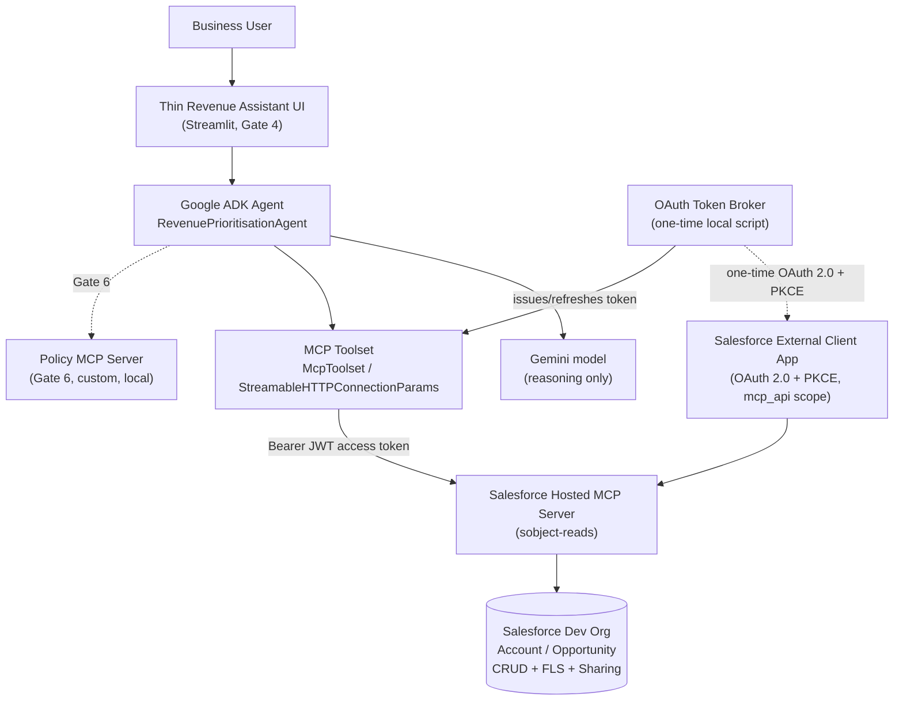
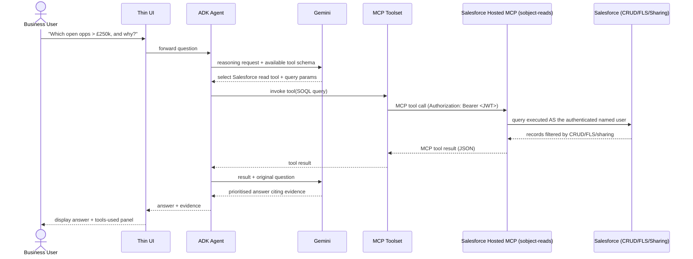
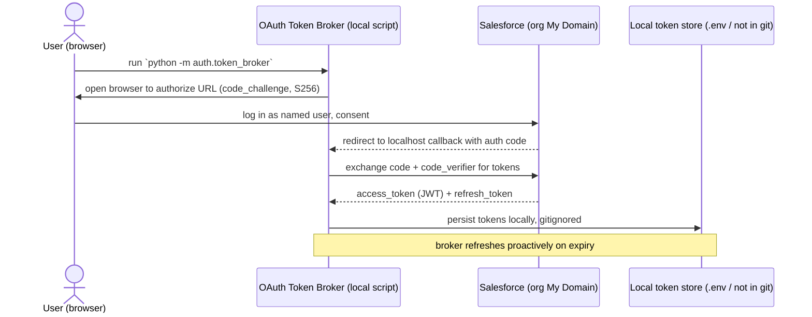
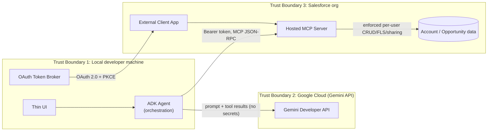

# Gate 0 Feasibility Report & Implementation Plan
### Revenue Prioritisation Agent — Salesforce Hosted MCP + Google ADK/Gemini

Status: **DRAFT — awaiting review/approval**
Author: Claude (Sonnet 5), synthesizing two primary-source research passes
Date: 2026-09-15

This document is the Gate 0 deliverable required by the build brief: a feasibility
verdict, validated architecture, Salesforce/Google setup plans, repository plan,
gate-by-gate backlog, security assessment, decision log, open questions, and
implementation order. **No agent/app code has been written yet.** Only this plan
and repository scaffolding (`.gitignore`, this doc) exist so far.

All claims below are sourced from live WebFetch/WebSearch against
developer.salesforce.com, help.salesforce.com, the `google/adk-python` GitHub repo
(including issue/PR history via `gh`), `ai.google.dev`, `cloud.google.com`, and
`modelcontextprotocol.io`, performed 2026-09-15. Confidence and source URLs are
given per claim. Anything not independently verified is explicitly flagged —
per the brief, this document does not silently paper over discrepancies.

---

## A. Feasibility verdict

**Yes, this architecture can be implemented today — with two caveats that must be
actively managed, not assumed away.**

- Salesforce Hosted MCP Servers reached **GA in April 2026** for Enterprise
  Edition+ orgs, and a separate April 2026 announcement extended it to
  **Developer Edition orgs for free**. The user's connected Dev org
  (`vikas_pandey@creative-narwhal-sf6pwp.com`) should have it — pending live
  verification (see Open Questions).
  Source: developer.salesforce.com/blogs/2026/04/salesforce-hosted-mcp-servers-are-now-generally-available,
  developer.salesforce.com/blogs/2026/04/new-developer-edition-agentforce-vibes-claude-mcp
- Google ADK's `McpToolset` **can** connect to a remote, OAuth+PKCE-protected MCP
  server (`StreamableHTTPConnectionParams`/`SseConnectionParams` + `auth_scheme`/
  `auth_credential`, or static `headers`/`header_provider`). PKCE support for the
  native OAuth flow only merged **2026-05-08** (adk-python commit `e7316dc0`) —
  roughly 4 months old at time of writing — and a related issue (**#2615**,
  authenticated remote Streamable-HTTP hang) is **still open**. Source:
  github.com/google/adk-python (issues #2615, #3331, #3621, #4708; commit `e7316dc0`).

**Caveat 1 — do not rely on ADK's native browser-popup OAuth flow for the
production path.** Treat it as unproven for this specific combination. **Caveat
2 — Salesforce's own docs conflict on cost** (see D5/Open Questions): the Get
Started guide says Flex Credits may apply; the GA and Dev Edition blogs imply
free inclusion. This must be checked live in the org, not assumed.

**Mitigation for Caveat 1 (recommended architecture, see D2):** a small,
one-time, standalone **OAuth token broker** script performs the Authorization
Code + PKCE flow once (browser consent), obtains access+refresh JWT tokens, and
the ADK `McpToolset` is configured with those tokens via static/dynamic
`Authorization: Bearer` headers — sidestepping ADK's native OAuth maturity risk
entirely. This is also the pattern ADK's own official third-party integration
docs (GitHub, Supermetrics, Windsor.ai) already use in practice, rather than the
native flow.

**Confidence: Medium-High.** All building blocks exist and are documented; the
residual risk is integration maturity (ADK+remote-OAuth-MCP is ~4 months old)
and org-specific cost/availability confirmation, both addressed by Gate 0/1/2
verification tasks below — not by the architecture itself.

**No protocol-level incompatibility exists.** Salesforce's ECA (OAuth 2.1 +
mandatory PKCE + RFC 8707 resource indicator + JWT access tokens) is a
conforming implementation of the MCP 2025-06-18 authorization spec
(modelcontextprotocol.io/specification/2025-06-18/basic/authorization, fetched
directly). The 2025-11-25/2026-07-28 spec deltas were only search-summarized,
not independently fetched — flagged for follow-up but unlikely to change this
verdict since they add hardening (OIDC discovery, `iss` validation), not new
mandatory mechanics.

---

## B. Validated target architecture

### Component diagram



### Sequence diagram — happy path (`AT-01`)



### Authentication flow — one-time token broker (`D2`)



### Trust boundaries



**Boundary notes:**
- B1↔B2: Gemini receives the user's question, tool schemas, and *retrieved CRM
  data as returned by MCP* (already permission-filtered). It never receives raw
  Salesforce credentials/tokens.
- B1↔B3: The only credential crossing this boundary is the per-user OAuth
  access token, scoped narrowly (`mcp_api`, `refresh_token`), obtained via
  Authorization Code + PKCE, never a shared/service-account credential.
- Each MCP server (Salesforce today; Policy MCP in Gate 6; Demandbase/Gong in
  the future-state) is its own independent trust domain — approval of one does
  not imply approval of another (brief §9).

---

## C. Salesforce setup plan

| Step | Action | Where | Source |
|---|---|---|---|
| 1 | Confirm Hosted MCP is present in the org | Setup → Quick Find → **"MCP Servers"** (under API Catalog); if absent, try Quick Find → **"Agentforce Vibes"** (Dev Edition path) | developer.salesforce.com/docs/platform/hosted-mcp-servers/guide/activate-mcp-servers.html |
| 2 | Check for Flex Credit billing exposure | Setup → Usage-Based Entitlements (or ask Salesforce AE) — **unresolved in primary docs, verify live** | see Open Questions |
| 3 | Activate the `sobject-reads` server only | MCP Servers page → toggle `sobject-reads` on (≈2 min to activate). Do **not** enable `sobject-all` or mutation servers. | developer.salesforce.com/docs/platform/hosted-mcp-servers/guide/servers-reference.html |
| 4 | Create dedicated Permission Set(s) | Setup → Permission Sets → new set(s) restricting Account/Opportunity field visibility (FLS) to only what the demo needs, plus a separate **"MCP Client User"** permission set used purely for ECA pre-authorization | developer.salesforce.com/blogs/2026/06/how-to-secure-salesforce-hosted-mcp-servers |
| 5 | Create the External Client App (ECA) | Setup → Quick Find → **"external client"** → External Client App Manager → New External Client App. OAuth scopes: **"Access MCP servers" (`mcp_api`)** + **"Perform requests at any time" (`refresh_token`)**. Security: enable **"Issue JSON Web Token (JWT)-based access tokens for named users"**. PKCE required (Authorization Code + PKCE only — no service account/M2M option exists for Hosted MCP). Client secret left **blank** (public/native client). | developer.salesforce.com/docs/platform/hosted-mcp-servers/guide/create-external-client-app.html |
| 6 | Gate authorization to named users | App Policies → Permitted Users = **"Admin approved users are pre-authorized"**, attach the "MCP Client User" Permission Set, assign only to the demo user | same as step 4 |
| 7 | Set refresh token policy | Refresh token validity ≤30 days, enable Refresh Token Rotation | developer.salesforce.com/docs/platform/hosted-mcp-servers/guide/create-external-client-app.html |
| 8 | Register redirect URI(s) | `http://localhost:8765/callback` for the token broker; `https://oauth.pstmn.io/v1/callback` for Postman (Gate 2 diagnostics) | developer.salesforce.com/docs/platform/hosted-mcp-servers/guide/postman.html |
| 9 | Wait for propagation | ECA can take **up to 30 minutes** to become operational after creation; server toggles take **up to 2 minutes** | developer.salesforce.com/docs/platform/hosted-mcp-servers/guide/create-external-client-app.html |
| 10 | Seed sample data | 5–10 Accounts, 8–15 Opportunities with varied Amount/Stage/CloseDate/tier/staleness/owner (brief §3) — scripted via `sf data import` from `salesforce/sample-data/*.csv`, run as the demo user or reassigned post-import to exercise sharing | scripted, see repo plan |
| 11 | Confirm My Domain is used everywhere | Use the org's actual My Domain URL for `login`/`authorize`/`token` endpoints, not bare `login.salesforce.com`, if Enhanced Domains is on (community-reported `invalid_client_id` gotcha) | secondary source, flagged low confidence — verify live |

**Manual vs. source-controlled (see D5 for full rationale):**
- **Manual, Setup-UI-only** (no CLI/metadata path found in research): Hosted MCP
  server activation, ECA creation/OAuth config, Permission Set pre-authorization
  policy attachment on the ECA.
- **Source-controlled metadata**: Permission Set(s) themselves (standard
  metadata type, deployable via `sf project deploy`).
- **Scripted, not metadata**: sample Account/Opportunity data (CSV + `sf data
  import`, idempotent, re-runnable against a fresh org).
- **Environment/secret config, never committed**: org My Domain URL, ECA
  consumer key, OAuth tokens (`.env`, gitignored, `.env.example` documents the
  shape only).

---

## D. Google/agent plan

- **ADK components**: `google.adk.tools.mcp_tool.mcp_toolset.McpToolset` with
  `StreamableHTTPConnectionParams(url=..., headers=...)` (fallback to
  `SseConnectionParams` if Salesforce's endpoint prefers SSE — confirm in Gate
  2/3), wrapped by one `Agent` (`RevenuePrioritisationAgent`) using the exact
  system instruction from brief §8 Gate 3.
- **Gemini model**: a current Flash-tier model with function-calling support
  (e.g. Gemini 2.5 Flash for maturity, or the newest Flash release available at
  build time — confirm exact current model ID and rate limits live in AI
  Studio, since Google does not publish fixed numbers). Avoid Pro-tier models —
  no free tier as of April 2026.
  Source: ai.google.dev/gemini-api/docs/models (fetched).
- **MCP integration / OAuth-token handling**: **do not** rely on `McpToolset`'s
  native `auth_scheme`/`auth_credential` OAuth flow for the primary path (see
  D2/Caveat 1). Instead: `auth/token_broker.py` performs the Authorization
  Code + PKCE exchange once interactively, persists access+refresh JWT tokens
  locally (gitignored), and `agent/mcp_config.py` supplies them to
  `McpToolset` via `header_provider` (so a refreshed token is always used,
  without restarting the agent).
- **Local runtime**: run locally via `adk web` (Gate 3 validation — its
  Events/Trace tabs directly satisfy the "observable sequence" exit criterion)
  and via the Streamlit UI (Gate 4). No GCP project required for this path.
- **Optional GCP deployment**: explicitly out of scope for this lab (brief
  §10 Portability). Vertex AI Agent Engine does **not** simplify OAuth handling
  — official docs indicate a custom frontend would be needed to replicate
  `adk web`'s consent flow — so there is no benefit to moving early, and the
  token-broker pattern means the runtime choice is now decoupled from the OAuth
  question anyway.

---

## E. Repository plan

```
sfdc-mcp-poc/
├── README.md                          # purpose, architecture, quick start, demo, limitations
├── .gitignore                         # done (Gate 0)
├── .env.example                       # documents required env vars, no real values
├── pyproject.toml
├── CLAUDE_BUILD_BRIEF_SALESFORCE_GEMINI_MCP.md   # already committed
│
├── agent/
│   ├── __init__.py
│   ├── agent.py                       # RevenuePrioritisationAgent definition
│   ├── prompts.py                     # system instruction (brief §8 Gate 3 contract)
│   ├── mcp_config.py                  # McpToolset wiring, header_provider using token store
│   └── config.py                      # env/config loading, validation
│
├── auth/
│   ├── __init__.py
│   ├── token_broker.py                # one-time interactive OAuth 2.0 + PKCE flow
│   └── token_store.py                 # local token persistence + refresh, redaction-safe logging
│
├── app/
│   └── app.py                         # Gate 4 thin Streamlit UI
│
├── policy_mcp/                        # Gate 6
│   ├── __init__.py
│   ├── server.py                      # official `mcp` Python SDK server
│   └── policy.py                      # scoring logic (brief §8 Gate 6 policy)
│
├── salesforce/
│   ├── setup.md
│   ├── external-client-app.md
│   ├── hosted-mcp.md
│   ├── permissions.md
│   ├── sample-data/
│   │   ├── accounts.csv
│   │   └── opportunities.csv
│   └── metadata/                      # Permission Set(s) only — force-app style
│
├── scripts/
│   ├── verify_environment.py          # checks Python/env/CLI prerequisites, no secrets printed
│   └── seed_data.py                   # wraps `sf data import` against sample-data/*.csv
│
├── tests/
│   ├── test_agent.py
│   ├── test_mcp_connection.py
│   ├── test_guardrails.py             # AT-02/AT-03/AT-04 style checks
│   ├── test_token_broker.py           # redaction, no-secret-in-logs (AT-06)
│   └── test_policy.py                 # Gate 6 scoring logic
│
└── docs/
    ├── gate-0-plan.md                 # this document
    ├── architecture.md                # produced Gate 1, formalizes section B
    ├── dfd.md                         # produced Gate 1
    ├── security-model.md              # produced Gate 1, formalizes section G
    ├── threat-model.md                # produced Gate 1, full STRIDE pass
    ├── demo-script.md                 # produced Gate 4
    ├── troubleshooting.md             # grown incrementally from Gate 1 onward
    └── decisions/
        ├── ADR-001-salesforce-mcp-server-choice.md
        ├── ADR-002-oauth-token-broker-pattern.md
        ├── ADR-003-local-adk-runtime.md
        ├── ADR-004-streamlit-ui.md
        ├── ADR-005-salesforce-config-as-code-boundary.md
        └── ADR-006-policy-mcp-sdk-choice.md
```

**Deviations from the brief's suggested structure, and why:**
- Added `auth/` — the brief didn't anticipate needing a dedicated OAuth broker
  module; research (D2) shows this is necessary given ADK's native-OAuth
  immaturity for this exact combination.
- Added `policy_mcp/` as its own top-level module (brief implied it might live
  under `agent/` or unspecified) — kept separate since it's an independently
  deployable MCP server, matching the brief's "each MCP server is an
  independent trust domain" principle even structurally.
- `docs/architecture.md`, `dfd.md`, `security-model.md`, `threat-model.md`,
  `demo-script.md` are **not** written in this Gate 0 PR — they get filled in
  as their respective gates land, so review stays focused per gate.

---

## F. Gate-by-gate implementation backlog

### Gate 0 — Research and feasibility (this document)
- **Tasks**: primary-source research (done), feasibility verdict, repo bootstrap.
- **Files changed**: `.gitignore`, `docs/gate-0-plan.md`.
- **Manual steps**: user reviews/approves this plan.
- **Tests**: none (no code yet).
- **Acceptance criteria**: plan approved; open questions answered.
- **Effort**: ~1 day (done).
- **Failure modes**: none remaining — verification tasks below carry forward into Gate 1.

### Gate 1 — Salesforce foundation
- **Tasks**: verify Hosted MCP availability + cost status in the connected Dev
  org; activate `sobject-reads`; create Permission Set(s) + ECA per section C;
  seed sample data; document everything in `salesforce/*.md`.
- **Dependencies**: Gate 0 approval; user's Salesforce org admin access.
- **Files changed**: `salesforce/*.md`, `salesforce/sample-data/*.csv`,
  `salesforce/metadata/` (Permission Set), `scripts/seed_data.py`,
  `scripts/verify_environment.py`, `.env.example`.
- **Manual steps**: all Setup UI steps in section C (server activation, ECA
  creation, PermSet assignment) — no CLI/API path exists for these per
  research.
- **Automated tests**: `scripts/verify_environment.py` (checks `sf` CLI auth,
  Python version, required env vars present — no secret values ever printed).
- **Acceptance criteria**: Setup → MCP Servers shows `sobject-reads` **Active**;
  ECA exists with correct scopes/PKCE/JWT settings; sample data queryable via
  SOQL in the org.
- **Effort**: 0.5–1 day, plus up to 30 min unavoidable ECA propagation wait.
- **Likely failure modes**: Hosted MCP not yet propagated to this specific org
  (fallback: request via Trust/Support, or provision a fresh Dev Edition trial
  org); `invalid_client_id` from Enhanced Domains/My Domain mismatch (section C
  step 11); Flex Credit billing surprise (check step 2 before scaling usage).

### Gate 2 — Prove MCP independently of Gemini (**mandatory gate**)
- **Tasks**: configure Postman per section C step 8 / Salesforce's documented
  manual OAuth 2.0 PKCE flow; discover tools (`tools/list`); perform a read;
  attempt an access-denied scenario (e.g., query a field the demo user's
  Permission Set excludes).
- **Dependencies**: Gate 1 complete.
- **Files changed**: `docs/troubleshooting.md` (seed with any issues hit),
  sanitized examples saved under `docs/` or `salesforce/hosted-mcp.md`.
- **Manual steps**: Postman configuration and interactive OAuth consent
  (one-time per Postman environment).
- **Automated tests**: none required by the brief for this gate (it's
  explicitly a manual diagnostic gate), but capture request/response JSON as
  fixtures for `tests/test_mcp_connection.py` in Gate 3.
- **Acceptance criteria**: sanitized `tools/list`, successful read, and
  access-denied examples captured; Salesforce MCP proven to work with zero LLM
  involvement.
- **Effort**: 0.5 day.
- **Likely failure modes**: redirect URI mismatch; ECA not yet propagated;
  wrong org (prod vs. sandbox `login`/`test` host) during OAuth.

### Gate 3 — Google ADK + Gemini
- **Tasks**: build `agent/` module per section D; build `auth/token_broker.py`
  + `auth/token_store.py`; wire `McpToolset` via `header_provider`; validate via
  `adk web` that the exact sequence in section B's sequence diagram is
  observable.
- **Dependencies**: Gate 2 complete (MCP proven independently); Google AI
  Studio API key obtained.
- **Files changed**: `agent/*.py`, `auth/*.py`, `pyproject.toml`, `.env.example`.
- **Manual steps**: create AI Studio API key (aistudio.google.com/apikey, no
  GCP project needed); run the token broker once interactively.
- **Automated tests**: `tests/test_mcp_connection.py` (mocked/recorded from
  Gate 2 fixtures), `tests/test_token_broker.py` (redaction/no-secrets-in-logs),
  `tests/test_agent.py` (tool selection logic where deterministic).
- **Acceptance criteria**: "Show me open opportunities worth more than £250k"
  produces the full observable chain in `adk web`'s Trace tab; response cites
  Salesforce evidence.
- **Effort**: 1–2 days, with schedule risk from ADK/remote-OAuth-MCP immaturity
  (budget extra time here specifically).
- **Likely failure modes**: `McpToolset` hangs against Streamable HTTP transport
  (known open issue #2615 — fallback to SSE transport if Salesforce supports
  it); Gemini free-tier rate limits during iterative testing.

### Gate 4 — Thin user interface
- **Tasks**: build `app/app.py` (Streamlit) — question box, answer display,
  collapsible "evidence/tools used" panel sourced from the agent's tool-call
  trace.
- **Dependencies**: Gate 3 stable.
- **Files changed**: `app/app.py`, `docs/demo-script.md` (first draft).
- **Manual steps**: none beyond running `streamlit run app/app.py`.
- **Automated tests**: light smoke test if practical (Streamlit apps are hard
  to unit test meaningfully — note this as a known limitation rather than
  over-engineering test coverage here).
- **Acceptance criteria**: non-technical viewer can ask the question, see the
  answer and evidence, without seeing tokens/credentials.
- **Effort**: 0.5–1 day.
- **Likely failure modes**: none architecture-specific; standard UI polish time.

### Gate 5 — Security unhappy paths
- **Tasks**: prove AT-03/AT-04 explicitly; attempt the "move every opp to
  Closed Won" prompt and confirm refusal; test with an expired/revoked token;
  grep repo + logs for secrets.
- **Dependencies**: Gate 4 complete (or can run in parallel with Gate 4 once
  Gate 3 is stable).
- **Files changed**: `tests/test_guardrails.py` (expanded), `docs/security-model.md`.
- **Manual steps**: manually revoke the ECA grant once to test failure
  behavior; manually restrict a field via FLS to test AT-01/AT-04 boundary.
- **Automated tests**: `tests/test_guardrails.py` covering AT-02, AT-03, AT-04,
  AT-06.
- **Acceptance criteria**: all of brief §12's AT-01 through AT-06 pass.
- **Effort**: 0.5–1 day.
- **Likely failure modes**: agent silently retries/hallucinates on denial
  instead of surfacing it — requires deliberate prompt/guardrail testing.

### Gate 6 — Second MCP server (Policy MCP)
- **Tasks**: implement `policy_mcp/server.py` using the official `mcp` Python
  SDK (stdio or local Streamable HTTP transport — no OAuth needed, it's a
  local trusted server); wire as a second `McpToolset` in `agent/agent.py`;
  validate the agent orchestrates across both servers itself (brief §8 Gate 6).
- **Dependencies**: Gate 5 complete.
- **Files changed**: `policy_mcp/*.py`, `agent/agent.py`, `agent/mcp_config.py`,
  `tests/test_policy.py`.
- **Manual steps**: none (local server, no external auth).
- **Automated tests**: `tests/test_policy.py` (scoring logic), extended
  `tests/test_agent.py` for multi-tool orchestration.
- **Acceptance criteria**: AT-05 passes — agent combines Salesforce CRM facts
  and Policy MCP output, explains the resulting ranking, and neither MCP server
  does the cross-source reasoning itself.
- **Effort**: 0.5–1 day.
- **Likely failure modes**: agent conflates the two servers' data provenance in
  its explanation — test explicitly that the response distinguishes CRM
  evidence from policy weighting.

---

## G. Security assessment

**Threats (brief §6 + STRIDE-lite pass):**
1. Prompt injection via malicious Salesforce field content (e.g., a
   Description field containing instructions) influencing agent behavior.
2. Excessive tool permissions — mitigated structurally by choosing
   `sobject-reads` (D1) over `sobject-all`.
3. Data exfiltration — Salesforce data reaching Gemini/Google beyond what's
   necessary; free-tier AI Studio traffic **may be used by Google to improve
   products** (ai.google.dev pricing/terms) — material if real customer data
   is ever used instead of synthetic demo data.
4. Token leakage via logs, error messages, or the repo.
5. Hallucination when Salesforce returns no/insufficient evidence (AT-02).
6. Unauthorized write execution if a future capability is added carelessly
   (AT-03 guards against this for the *current* read-only scope).
7. Cross-tool data leakage once a second MCP server exists (Gate 6) — policy
   data and CRM data must stay attributable to their source.
8. Apex-backed custom tools (if ever added later) could run "without sharing,"
   silently bypassing the sharing enforcement that `sobject-reads` gets for
   free — a governance point for any future custom server, not a risk in the
   current MVP scope.

**Controls:**
- Least privilege: `sobject-reads` only; dedicated Permission Set(s) for the
  demo user; ECA pre-authorization restricted to that user (section C).
- Per-user identity: no service-account/M2M path exists for Hosted MCP —
  every call is attributed to the authenticated named user, enforced by
  Salesforce CRUD/FLS/sharing.
- Secrets: `.gitignore` already excludes `.sf/`, `.env`, `*credentials*.json`,
  keys/PEMs; token broker persists tokens outside the repo tree; `.env.example`
  documents shape only.
- Guardrails: explicit system instruction ("never invent CRM information,"
  "do not modify Salesforce data," brief §8) plus automated tests (AT-02
  through AT-04, Gate 5).
- Observability: correlate user → agent request → tool selected → MCP
  invocation → Salesforce result → agent response, without logging secrets or
  full record payloads (structured logging with redaction, built in Gate 3/5).
- Auditability on the Salesforce side: MCP activity is visible in Event
  Monitoring, filterable by `API_CLIENT_CATEGORY = SALESFORCE_HOSTED_MCP`.

**Residual risks:**
- ADK's native OAuth path for remote MCP is young (~4 months); mitigated by
  not using it as the primary mechanism (D2), but the token-broker pattern
  itself is a custom component that needs its own care (token storage,
  refresh-failure handling) — not zero-risk, just lower-risk than the
  alternative.
- Cost/licensing status of Hosted MCP in this specific org is unverified from
  primary sources (Open Questions) — theoretically could incur Flex Credit
  usage if assumptions about Dev Edition inclusion don't hold.
- Free-tier Gemini data-usage terms are a real consideration the moment this
  moves beyond synthetic demo data.

**Items requiring enterprise/client confirmation (explicitly flagged, not
resolved by this lab):** production refresh-token/session policy; whether
Google Workspace/Cloud org policy permits AI Studio free-tier data terms for
any real data; formal DPA/data-residency requirements for Gemini if this ever
touches non-synthetic CRM data; Salesforce billing owner sign-off on Flex
Credit exposure before any broader rollout.

---

## H. Decision log

### D1 — Salesforce MCP server
**Options:** `sobject-all` (broad CRUD) vs. `sobject-reads` (read/query only) vs. custom server.
**Recommendation: `sobject-reads`.**
**Rationale:** Narrowest server that fully satisfies the read-only Account/Opportunity use case (brief explicitly requires the agent cannot write); avoids exposing mutation tools "merely because Salesforce can provide them." **Confidence: High** — directly documented server reference table.

### D2 — Authentication (ADK ↔ Salesforce Hosted MCP)
**Options:** (a) rely on ADK's native `auth_scheme`/`auth_credential` OAuth+PKCE flow; (b) one-time external OAuth token broker feeding static/dynamic Bearer headers into `McpToolset`.
**Recommendation: (b), the token broker pattern.**
**Rationale:** ADK's native PKCE support merged only 2026-05-08; a directly relevant issue (authenticated remote Streamable-HTTP hang, #2615) is still open; official ADK integration examples (GitHub, Supermetrics, Windsor.ai) themselves favor static-header bearer tokens over the native dance in practice. The broker isolates this risk into one small, testable, replaceable component instead of embedding it in the agent framework's newest code path. **Confidence: Medium-High.**

### D3 — Agent runtime
**Options:** local ADK runtime vs. Vertex AI Agent Engine vs. other GCP target.
**Recommendation: local ADK runtime.**
**Rationale:** brief's own default preference; user currently has neither a GCP project nor Vertex AI enabled; Agent Engine does not simplify OAuth (docs suggest it requires a custom frontend to replicate `adk web`'s consent flow) and the token-broker pattern already decouples OAuth from runtime choice, removing the one reason that might have justified Agent Engine. **Confidence: High.**

### D4 — UI
**Options:** `adk web` alone vs. Streamlit vs. custom frontend.
**Recommendation: `adk web` for Gate 3 technical validation; a minimal Streamlit app for Gate 4's business-facing demo.**
**Rationale:** `adk web`'s Events/Trace/Graph tabs already satisfy Gate 3's "observable sequence" exit criterion with zero extra engineering — use it there. But the brief explicitly wants a distinct Gate 4 UI deliverable for a non-technical audience; Streamlit is the minimum-engineering option that still shows question/answer/evidence, and since OAuth is already handled by the token broker (D2), the UI layer carries none of that complexity. **Confidence: High.**

### D5 — Salesforce configuration-as-code boundary
**Options:** full metadata-as-code vs. fully manual vs. a split.
**Recommendation: split** — Permission Set(s) as source-controlled metadata; sample data as a scripted, idempotent CSV import; Hosted MCP server activation and ECA creation as documented manual Setup UI steps (no CLI/metadata/API path was found in research for either); all identifiers/secrets as environment configuration, never committed.
**Rationale:** Don't force declarative deployment where Salesforce doesn't support it cleanly (brief §7) — and research found no evidence such support exists yet for MCP server activation or ECA creation. **Confidence: Medium** on the "no CLI/metadata path exists" claim — it's an absence-of-evidence finding from the research pass, not a confirmed negative; worth a quick double-check in Gate 1 before finalizing `salesforce/setup.md`.

### D6 — Read capability shape
**Options:** generic `sobject-reads` SOQL-style tool vs. a purpose-built Flow/Apex/Named Query tool scoped to only Account/Opportunity fields.
**Recommendation: start with `sobject-reads`** (generic), rely on FLS/Permission Set to bound the actual field/object exposure; revisit a custom Named Query tool only if the enterprise security conversation specifically demands server-side (not just permission-side) object/field restriction.
**Rationale:** Fastest path to proving the use case with least engineering, consistent with "prefer the narrowest capability that proves the use case" — narrowness here is achieved via the permission model rather than a bespoke tool, which is an explicit, documented tradeoff worth surfacing to the audience during the demo (it's a good talking point for docs/demo-script.md: "least privilege is enforced by Salesforce's permission model, not by hand-restricting the tool's surface"). **Confidence: Medium** — reasonable for a lab; a stricter enterprise deployment would likely want the custom-tool version, and that tradeoff should be stated explicitly, not glossed over.

### D7 — Policy MCP server implementation
**Options:** hand-rolled JSON-RPC server vs. the official `mcp` Python SDK (`pip install mcp`, from the `modelcontextprotocol/python-sdk` reference implementation).
**Recommendation: official `mcp` Python SDK.**
**Rationale:** minimal, first-party, no bespoke protocol code, matches brief §11 D7's ask for "no unnecessary infrastructure." **Confidence: High.**

---

## I. Open questions

Only items that genuinely block moving into Gate 1 — everything else above is
resolved from primary documentation.

1. **Org verification method** — the connected Dev org's `sf` CLI session
   currently shows an error status ("HTTP response contains html content"),
   suggesting an expired session. Do you want me to attempt re-authentication
   and query the org directly (via `sf`/Tooling API) to check Hosted MCP
   availability and Permission Set state, or will you check manually via Setup
   UI and report back what you see?
2. **Which org to use** — reuse the already-connected
   `vikas_pandey@creative-narwhal-sf6pwp.com` Dev org as-is, or provision a
   fresh Developer Edition org for a known-clean lab environment (no
   pre-existing metadata/config history to account for)?
3. **Cost verification owner** — given the primary-source conflict on Flex
   Credit billing (section A/G), do you want to check Setup → Usage-Based
   Entitlements yourself, or should I look for a way to check it via CLI/API
   once org access is confirmed?
4. **Gate 2 diagnostic client** — Salesforce's own docs name Postman as the
   recommended tool (with a full documented manual config, no importable
   collection found) and separately mention MCP Inspector for troubleshooting.
   Do you have Postman available and want to use it, or prefer MCP Inspector?
5. **Google AI Studio key** — do you want to create the free API key now (no
   GCP project required, aistudio.google.com/apikey) so Gate 3 isn't blocked
   later, or handle it when we reach Gate 3?

---

## J. Implementation order

1. Resolve Open Questions 1–5 above.
2. **Gate 1** — Salesforce foundation (org verification, `sobject-reads`
   activation, Permission Set + ECA creation, sample data seeding). Stop and
   show evidence per brief §17.
3. **Gate 2** — Prove MCP independently via Postman/MCP Inspector (mandatory
   gate). Stop and show evidence.
4. **Gate 3** — Build `auth/` token broker + `agent/` ADK integration; validate
   via `adk web`. Stop and show evidence.
5. **Gate 4** — Streamlit thin UI. Stop and show evidence.
6. **Gate 5** — Security unhappy-path tests (AT-01 through AT-06 in full).
   Stop and show evidence.
7. **Gate 6** — Policy MCP server + multi-MCP orchestration demo. Stop and
   show evidence.
8. Final documentation pass (`docs/architecture.md`, `dfd.md`,
   `security-model.md`, `threat-model.md`, `demo-script.md`,
   `troubleshooting.md`) consolidated from what was actually built, plus ADRs
   for each decision in section H.

Each gate proceeds only after explicit approval of the previous one, on its own
branch, via PR, per the agreed git workflow.
