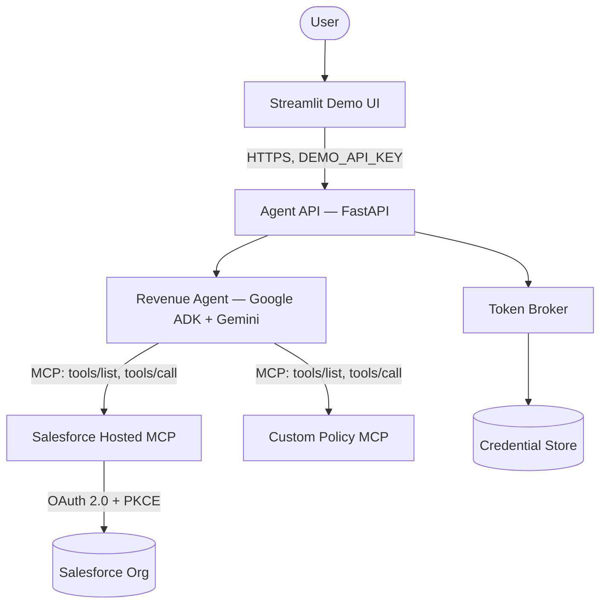
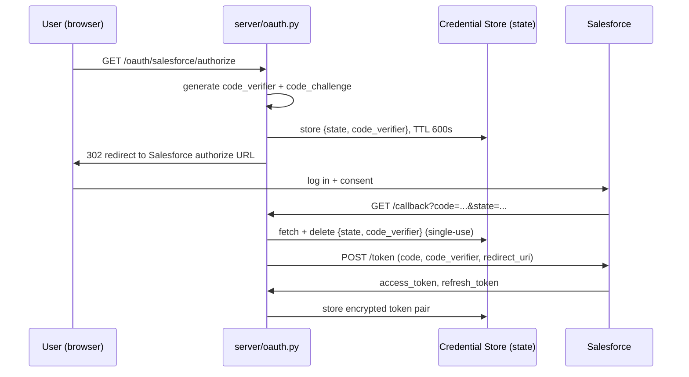
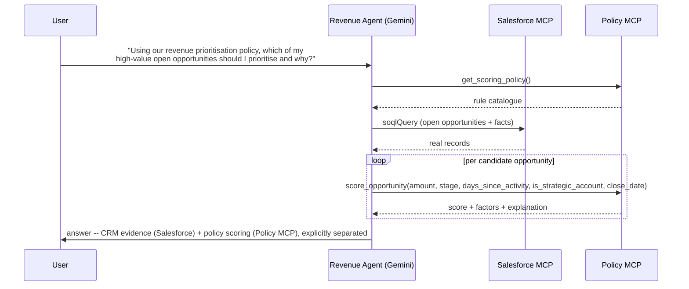
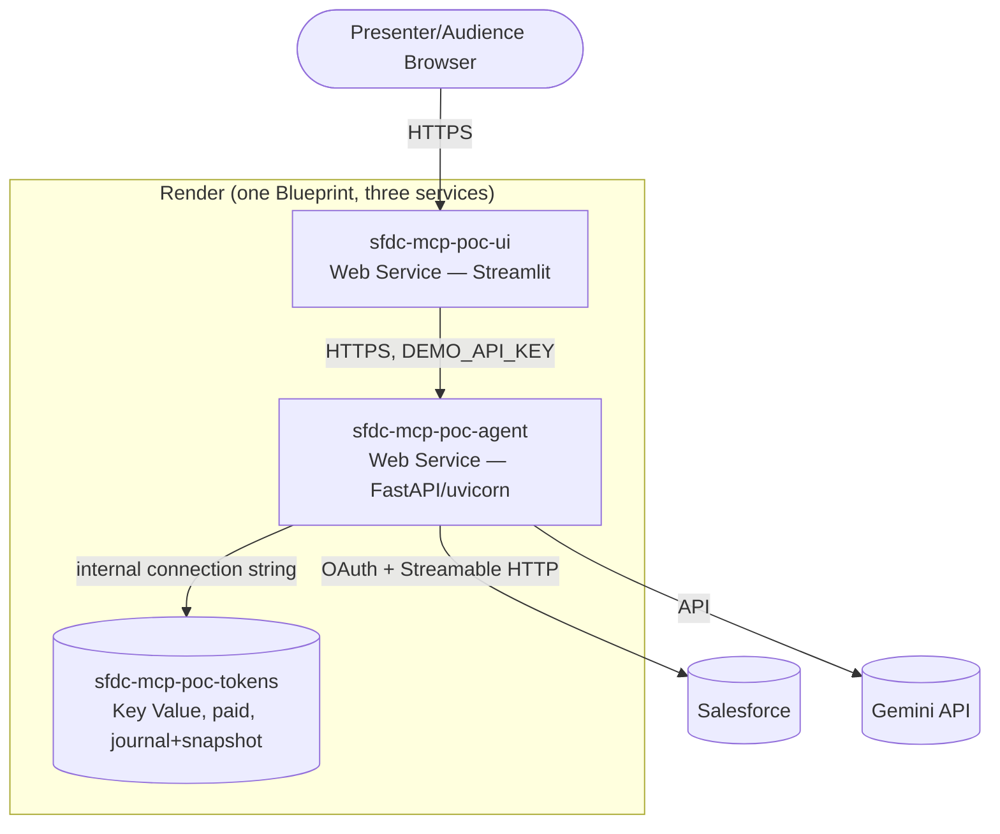
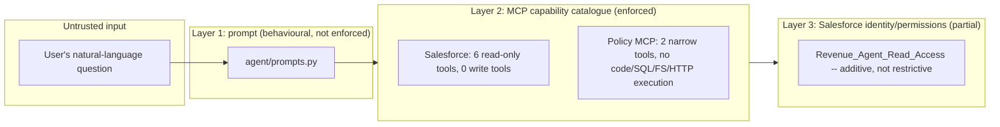

# Technical Solution Design — Salesforce MCP Revenue Agent

Status: reflects the implementation as of Gate 8 (documentation/public-release readiness). Written for
architecture review — Enterprise/Salesforce/AI-Agent/Security architects and engineering leads. Every
claim below is grounded in this repository's actual code, tests, ADRs, or live acceptance evidence; see
[`docs/evidence-matrix.md`](evidence-matrix.md) for the explicit claim-to-evidence mapping. Where
something is designed but not yet built, or built but not yet proven, that is stated explicitly rather
than implied.

## 1. Executive Summary

This project is a proof of concept for an AI agent that reasons over enterprise systems through the
Model Context Protocol (MCP) rather than direct API integration. It connects a Google ADK/Gemini agent to
two independent MCP servers — Salesforce's own vendor-hosted `sobject-reads` server, and a custom,
application-owned "Policy MCP" server implementing deterministic revenue-prioritisation scoring — and
demonstrates, with live evidence, that the agent orchestrates across both through the same protocol,
combining real CRM facts with deterministic policy output in a single grounded answer. The whole system
is deployed on Render as a hosted, restart-durable service with OAuth 2.0 + PKCE authentication, a
three-layer defence-in-depth security model, and a thin Streamlit demo UI.

## 2. Business Context

Revenue teams need to know which open opportunities deserve attention now, and why. That "why" has two
independent sources today: the CRM (what's actually true about the deal) and an informal, undocumented
sense of which deals matter (size, urgency, account importance, staleness). This project makes the second
source explicit, deterministic, and auditable — a fixed policy, not a model's guess — and has an agent
combine it with real CRM facts on demand, in natural language, with the underlying evidence shown.

## 3. Objectives

1. Prove that an LLM-based agent can be given governed access to a real enterprise system (Salesforce)
   through MCP, without holding that system's credentials itself.
2. Prove the same agent can be given a second, custom, application-owned capability through the same
   protocol, with no special-casing between "vendor" and "ours" in application code.
3. Prove a working multi-MCP orchestration scenario with live evidence, not a scripted demo.
4. Establish and demonstrate a genuine, three-layer, evidence-backed security model rather than a
   prompt-only one.
5. Deploy the result as a durable, restart-safe hosted service reachable without the developer's own
   laptop, for client demonstration.

## 4. Scope

- One vendor MCP integration (Salesforce Hosted MCP, read-only `sobject-reads`).
- One custom MCP server (Policy MCP), deterministic opportunity scoring, two tools.
- One LLM provider (Gemini, via Google ADK).
- OAuth 2.0 Authorization Code + PKCE against a Salesforce External Client App.
- Hosted deployment on Render (agent API, demo UI, encrypted token persistence).
- Automated and live acceptance evidence for every claim made about the system.

## 5. Out of Scope (explicitly, per this project's own build brief and Gate 8's feature freeze)

- Demandbase Capability, Gong Capability, or any additional MCP server beyond Salesforce and Policy MCP
  — named as capabilities here deliberately, since no MCP (or other) implementation for either has been
  built, evaluated, or approved.
- Any LLM provider other than Gemini.
- Any database (PostgreSQL, etc.) — hosted persistence uses a managed Key Value store for exactly one
  encrypted value, not a schema'd datastore.
- Write access to Salesforce, in any form.
- A rules-engine product for Policy MCP — its rules are plain, committed Python.
- Enterprise SSO/identity federation for the demo UI — it uses a shared-secret access code, deliberately.
- Multi-tenant support, horizontal scaling, or high-availability design beyond what Render's own free/paid
  tiers provide by default.

## 6. Functional Requirements

| ID | Requirement | Status |
|---|---|---|
| FR-1 | Agent answers questions about real Salesforce Opportunity/Account data | ✅ Proven live |
| FR-2 | Agent refuses to attempt a Salesforce mutation, for any phrasing | ✅ Proven live (single-record and bulk phrasing) |
| FR-3 | Agent does not invent data for a nonexistent record | ✅ Proven live |
| FR-4 | Agent scores opportunities against a fixed, deterministic policy | ✅ Proven (offline + live) |
| FR-5 | Agent combines Salesforce facts and Policy MCP output in one answer, attributing each correctly | ✅ Proven live |
| FR-6 | System survives a process/service restart without re-authenticating | ✅ Proven live (Gate 4) |
| FR-7 | A non-technical user can drive the demo through a UI without seeing any secret | ✅ Proven live + tested |

## 7. Non-Functional Requirements

| NFR | Target | How it's met |
|---|---|---|
| Security | No credential ever reaches the LLM or the model's context; least-privilege Salesforce access | Header-provider-injected Bearer tokens; read-only Permission Set + MCP catalogue with no write tool |
| Maintainability | New MCP servers/capabilities addable without touching the agent's core loop | `McpToolset` is the only integration point; two servers already proven interchangeable to the agent |
| Observability | Every tool call and failure is traceable, without leaking secrets | `docs/security-model.md`; dedicated log-redaction module and tests |
| Testability | Every acceptance claim has an automated or live test | `docs/evidence-matrix.md` |
| Portability | Credential storage swappable without touching business logic | `CredentialStore` abstraction (Local/Hosted) |
| Reproducibility | A second engineer can rebuild this from the repo alone | `docs/developer-guide.md` walks every gate from a fresh org |

Scalability, availability, and performance are **deliberately not optimised** for this POC — see
"Productionisation considerations" (§29).

## 8. Architecture Principles

See `README.md`'s "Key architectural principles" for the list; not repeated here. The one worth expanding
on for an architecture review: **MCP as capability boundary is the load-bearing security decision in this
entire system.** Every other control (the prompt instruction, the Permission Set) is real but secondary —
the reason a compromised or confused model cannot mutate Salesforce data is that no mutation-shaped tool
exists in the catalogue it can see, full stop. This was proven independently of any LLM in Gate 2 (Postman,
zero model involvement) before a single line of agent code existed.

## 9. Logical Architecture

**Diagram A — Logical architecture**

The agent has exactly two integration points — `McpToolset` instances — and no other path to either
system. The API layer's only job is authentication (`DEMO_API_KEY`), request/response shaping, and
startup validation; it holds no business logic.

## 10. Component Architecture

| Component | File(s) | Responsibility |
|---|---|---|
| Agent API | `server/app.py` | FastAPI entry point: `/health`, authenticated `/ask`, startup config validation, exception redaction |
| Revenue Agent | `agent/agent.py`, `agent/prompts.py` | Google ADK `Agent` — model, instruction, tool wiring |
| MCP wiring | `agent/mcp_config.py` | Builds both `McpToolset` instances (Salesforce Streamable HTTP; Policy MCP stdio) |
| OAuth token broker | `auth/token_broker.py` | PKCE flow, token exchange/refresh, pure functions for both local and hosted callback routes |
| Credential storage | `auth/credential_store.py` + `local_credential_store.py` + `hosted_credential_store.py` | Abstraction over OS keyring (local) / Render Key Value (hosted), Fernet-encrypted |
| Hosted OAuth routes | `server/oauth.py` | `/oauth/salesforce/authorize` and `/callback`, Redis-backed transient PKCE state |
| Log redaction | `server/log_redaction.py` | Scrubs secret values from anything logged, including unanticipated exception tracebacks |
| Policy MCP | `policy_mcp/policy.py`, `policy_mcp/server.py` | Deterministic scoring logic + MCP server exposing it |
| Demo UI | `app/app.py` | Streamlit thin client — access-code gate, question box, evidence panel |

## 11. Salesforce Architecture

- **Org**: Developer Edition, Hosted MCP framework enabled (GA since April 2026 for Dev Edition orgs).
- **Permission Set** (`Revenue_Agent_Read_Access`): read-only Account/Opportunity/Task, no
  create/edit/delete/view-all. Additive, not restrictive — see §28.
- **External Client App** (`Revenue_Agent_MCP_Client`): OAuth scopes `mcp_api` + `refresh_token` only
  (not the broad `api` scope), PKCE enabled, no client secret (`isConsumerSecretOptional=true`).
- **MCP server activated**: `sobject-reads` only. No `sobject-all` or any mutation-capable server is
  active — this is the actual enforced read-only boundary, independent of the Permission Set.

## 12. MCP Architecture

Both MCP servers are ordinary `McpToolset` instances to the agent (`agent/agent.py`):

| | Salesforce Hosted MCP | Custom Policy MCP |
|---|---|---|
| Hosting | Vendor-hosted, remote | Local subprocess, stdio |
| Transport | `StreamableHTTPConnectionParams` | `StdioConnectionParams` |
| Auth | Bearer token via `header_provider`, sourced from the token broker | None — local, trusted, no network |
| Tools | `soqlQuery`, `find`, `getRelatedRecords`, `listRecentSobjectRecords`, `getUserInfo`, `getObjectSchema` (6, all read-only) | `score_opportunity`, `get_scoring_policy` (2) |
| Trust domain | Independent — Salesforce's own | Independent — this project's own |

Each is its own trust domain (per the original build brief's explicit rule): approving one never
pre-approves the other, or any future server.

## 13. Agent Architecture

Google ADK `Agent`, model pinned via `GOOGLE_GENAI_MODEL` (checked live against Gemini's `ListModels` API
before being set, never chosen dynamically at runtime). Instruction (`agent/prompts.py`) is two parts:
`SYSTEM_INSTRUCTION` (verbatim from the build brief, pinned byte-for-byte by a test) plus an appended
`POLICY_MCP_ADDENDUM` telling the model these tools exist and that it — not either MCP server — must
combine their output. The agent decides every tool call itself; nothing in `agent/agent.py` scripts a
sequence.

## 14. Integration Architecture

The only integration surface the agent has is MCP (`tools/list`/`tools/call`). The API layer
(`server/app.py`) is the only integration surface a *client* (the demo UI, or any other caller) has, and
it is a plain authenticated JSON API (`POST /ask`), not MCP itself — this project does not expose the
agent as an MCP server to further clients; that was never a stated goal.

## 15. Identity and OAuth Architecture

**Diagram B — OAuth 2.0 Authorization Code + PKCE sequence**

No client secret exists anywhere in this flow — the ECA is a genuine public/PKCE-only client. The
transient `state`/`code_verifier` pair lives in the same Redis-compatible store as the long-lived token
pair, TTL-bound and deleted on first use, rather than in-memory (which would break across a stateless
container restart) or a second persistence mechanism.

## 16. Sharing & Security

Salesforce sharing/FLS is enforced by the platform itself, underneath whatever the MCP server's tools do —
this project does not re-implement or bypass Salesforce sharing rules. The Permission Set's
Account/Opportunity/Task field-level access was deployed and independently verified via SOQL (not just the
deploy command's own success message) — see `salesforce/permissions.md`.

## 17. Data Architecture and Data Boundaries

- **Salesforce is the only system of record for CRM data.** Nothing in this project caches, duplicates,
  or persists Salesforce record data outside of a single request's lifetime.
- **Policy MCP holds zero Salesforce data.** It receives facts as tool-call arguments and returns a
  computed result; it never queries Salesforce, and its source contains no Salesforce credential or
  import (verified by a dedicated static test — see §26/ADR-004).
- **The only thing persisted between requests** is the encrypted OAuth token pair, in the hosted
  credential store. No CRM data, no conversation history beyond a single in-memory ADK session, is
  persisted anywhere.

## 18. Policy MCP Design

Full rationale in [`docs/decisions/ADR-004-policy-mcp-design.md`](decisions/ADR-004-policy-mcp-design.md)
— summarised: stdio transport (simplest fit for a local, trusted, single-consumer server), plain-Python
configuration (no database, no rules-engine product, no YAML parsing risk for five constants), exactly two
narrowly-typed tools (no arbitrary code/SQL/filesystem/HTTP capability). The rule set itself is copied
verbatim from the original build brief's own example policy (amount, close-date proximity, strategic
account, activity staleness, priority stage), with one documented substitution (USD $250k threshold,
matching this project's own established currency convention, in place of the brief's GBP figure).

## 19. Multi-MCP Orchestration

**Diagram D — Multi-MCP orchestration sequence (Gate 7's core evidence)**

This sequence is illustrative of what actually happened in a live run, not idealised — the real trace
also included `getUserInfo`/`getObjectSchema` calls the model chose to make along the way (see
`docs/developer-guide.md`'s Gate 7 section for the exact captured trace). Gemini's own tool-selection
legitimately varies run to run; what's structurally guaranteed and tested
(`tests/test_multi_mcp_live.py`) is that both servers get used and the final answer demonstrably contains
real values from both, not that the exact call order above repeats identically.

## 20. Deployment Architecture

**Diagram E — Deployment architecture**

No database, no Kubernetes, no additional microservices — deliberately (Gate 4's own architectural
principles, carried through Gate 5/7's additions). Full provisioning order and environment-variable
reference: [`docs/deployment-guide.md`](deployment-guide.md).

## 21. Credential Management

`CredentialStore` abstraction (`auth/credential_store.py`), two implementations selected by
`CREDENTIAL_STORE_BACKEND`:

| | Local | Hosted |
|---|---|---|
| Backend | OS keyring | Render Key Value (Redis-compatible) |
| Encryption | OS keyring's own | Fernet, key in a separate env var (`CREDENTIAL_ENCRYPTION_KEY`), never colocated with ciphertext |
| Fallback behaviour | Raises rather than silently degrading to file-colocated key+ciphertext | N/A — fails fast if `REDIS_URL`/`CREDENTIAL_ENCRYPTION_KEY` missing |

The factory (`get_credential_store()`) refuses to silently default to `Local` when running on Render
(`RENDER=true`) unless `CREDENTIAL_STORE_BACKEND` is explicitly set — a deliberate fail-fast guard against
accidentally running the dev-only store in production. Full comparison of hosted persistence options
(Disks/Key Value/Postgres/external secrets manager) is in
[`docs/decisions/ADR-003-hosted-credential-persistence.md`](decisions/ADR-003-hosted-credential-persistence.md).

## 22. Observability and Error Handling

- `GET /health` returns only `{"status": "ok"}` — no version, config, or diagnostic detail.
- `/ask`'s exception handling pairs a specific, anticipated exception set (`RuntimeError`,
  `ConnectionError`, `TimeoutError`, `urllib.error.HTTPError` → clean 503, "Salesforce authorization
  unavailable") with a catch-all (`Exception` → clean 503, generic retry message) — so an unanticipated
  failure (e.g. a Gemini quota error) never surfaces as a raw, unhandled 500.
- `server/log_redaction.py` scrubs configured secret values plus Bearer/query-param patterns from any
  logged text, and formats unanticipated exception tracebacks manually rather than via
  `logger.exception()`/`exc_info=True` — which would otherwise bypass message-level redaction entirely.

## 23. Testing Strategy

Two tiers, by design:

1. **Offline** (`pytest -q`, default): fully mocked — fake keyring, fake Redis, fake Salesforce/Gemini
   responses. Fast, runs everywhere, no live dependency. 101 passed, 5 skipped (the opt-in tier below).
2. **Live/opt-in** (`pytest --run-integration ...`): hits the real Salesforce org and real Gemini API.
   Deliberately excluded from the default run (cost, latency, quota) but is where every "proven live" claim
   in this document is actually backed by a repeatable, automated check, not a one-off manual run.

**Known test-harness gap** (not a product defect): running the full opt-in suite in one `pytest` process
pollutes a shared module-level singleton due to an unrelated test's `importlib.reload` — always run the
live suite as a targeted invocation excluding `tests/test_agent.py`. See
`docs/troubleshooting.md`'s Gate 7 section.

## 24. Security / Threat Considerations

**Diagram F — Trust boundaries**

Threat model highlights (full detail in `docs/security-model.md`):

- **Prompt injection via a malicious Salesforce field value**: bounded by Layer 2 — even a fully
  successful injection has no mutation tool to reach for.
- **Compromised/confused model attempting a write**: same — the tool doesn't exist to call.
  regardless of intent.
- **Credential exposure**: the model never sees a token (header-provider injection); logs are redacted at
  two levels (message-level + exception-level); full-history secret scan performed for public release
  (`docs/public-release-readiness.md`).
- **Policy MCP as an attack surface**: deliberately narrow — two typed tools, no arbitrary execution
  capability, no credential material of any kind (static test-enforced).
- **Not yet fully validated**: Layer 3's *effective* restrictiveness independent of the MCP catalogue —
  see §28.

## 25. Failure Scenarios

| Scenario | Behaviour | Evidence |
|---|---|---|
| Salesforce token expired/revoked | Clean 503, "Salesforce authorization unavailable", no bypass, no detail leak | Offline test (`tests/test_server_app.py`); live test deliberately deferred (§28) |
| Gemini API error/quota exhausted | Clean 503, generic retry message (catch-all handler) | Offline test; hit live once during Gate 4, documented in `docs/troubleshooting.md` |
| Policy MCP receives invalid input | MCP-level tool error (`isError: true`), never a fabricated score | `tests/test_policy.py`, both direct-call and real-stdio-subprocess |
| Nonexistent Salesforce record requested | Agent states no match found, does not invent detail | Live test (`tests/test_guardrails.py`) |
| Render service restart | Resumes without re-authorization — token persists in Key Value | Live evidence, Gate 4 |
| UI access code guessed repeatedly | Per-session lockout after 5 attempts (60s) | `tests/test_app.py` |

## 26. ADR Summary

| ADR | Decision |
|---|---|
| [ADR-002](decisions/ADR-002-oauth-authentication-strategy.md) | Header-provider-based Bearer auth (Branch 3B), not ADK's native OAuth handler, which unconditionally requires a client secret this public/PKCE client doesn't have |
| [ADR-003](decisions/ADR-003-hosted-credential-persistence.md) | Render Key Value (paid, Journal+Snapshot), not Disks/Postgres/an external secrets manager |
| [ADR-004](decisions/ADR-004-policy-mcp-design.md) | Local stdio transport, plain-Python config, exactly two tools for Policy MCP |

## 27. Known Limitations

See `README.md`'s "Known limitations" — not duplicated here; that list is the canonical one.

## 28. Deferred Security Items

Both deliberate, both recorded in `docs/security-model.md`'s Gate 6 section, neither silently assumed done:

1. **A genuinely restricted second Salesforce test identity** — to prove *effective* access is
   read-only independent of the MCP catalogue (the current Permission Set is additive, not restrictive).
2. **A live test of Salesforce credential revocation** — would require breaking the working demo's real
   credentials; the offline-mocked equivalent (RuntimeError/ConnectionError → clean 503) is tested.

## 29. Productionisation Considerations

Before any production deployment, this POC would need, at minimum:

- Enterprise SSO/identity federation, replacing the shared-secret `DEMO_API_KEY`/`UI_ACCESS_CODE` scheme.
- The two deferred security items above, actually completed.
- Horizontal scaling / multi-instance design (the current hosted credential store's single-key model
  assumes low concurrency; Render's free/starter tiers are not an availability SLA).
- Structured monitoring/alerting beyond `GET /health`'s binary signal.
- A rotation policy for `CREDENTIAL_ENCRYPTION_KEY`, `DEMO_API_KEY`, and `UI_ACCESS_CODE`.
- Formal data governance/retention policy, even though no CRM data is currently persisted outside a
  single request.
- A real incident-response runbook for a compromised MCP server or leaked credential, beyond this
  document's threat-model narrative.

## 30. Future-State Architecture

See `README.md`'s "Future evolution" section (Demandbase Capability/Gong Capability, model-provider
portability) — not duplicated here. **MCP interoperability across independent servers has been
demonstrated (Salesforce + Policy MCP); LLM-provider portability has not** — the two are independent
claims, and this document makes only the first. The one addition worth stating at solution-design depth: **the current
architecture is designed to localise those changes rather than require a wholesale redesign.** Adding a
third MCP server or swapping the LLM provider are both changes this design concentrates in
`agent/mcp_config.py` and `agent/agent.py` respectively — neither has been attempted, and this document
does not claim either would be friction-free in practice. Provider-specific auth mechanisms and
tool-calling semantics can still force real changes beyond those two files; "localised" is not a promise
of "trivial."
